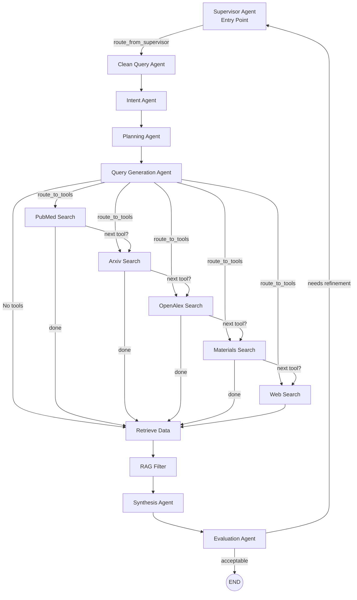
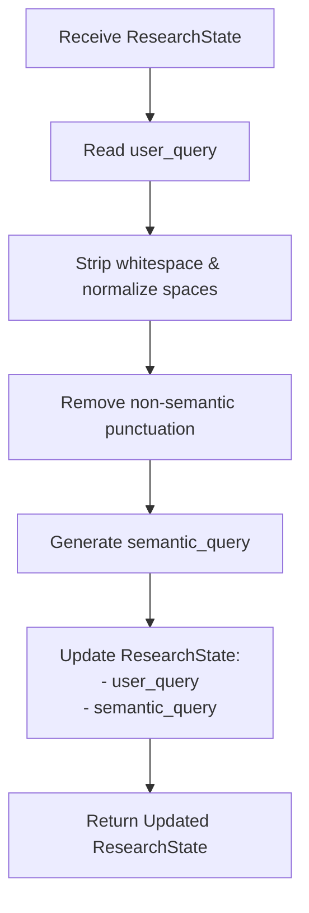
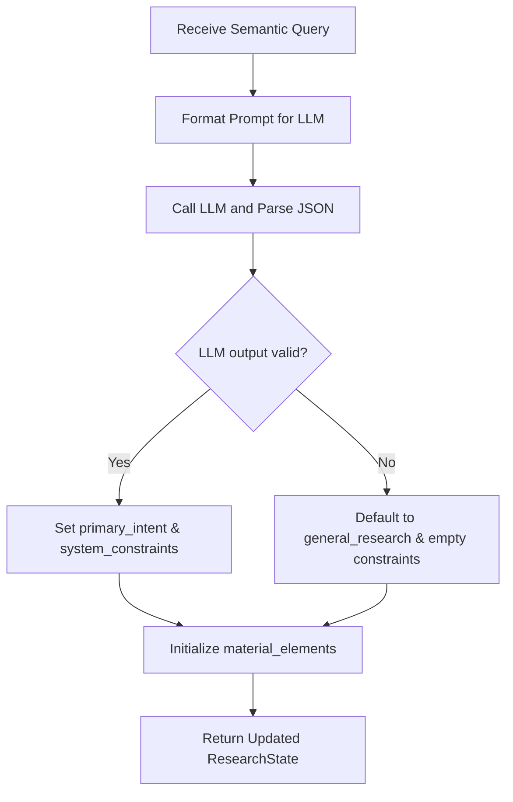
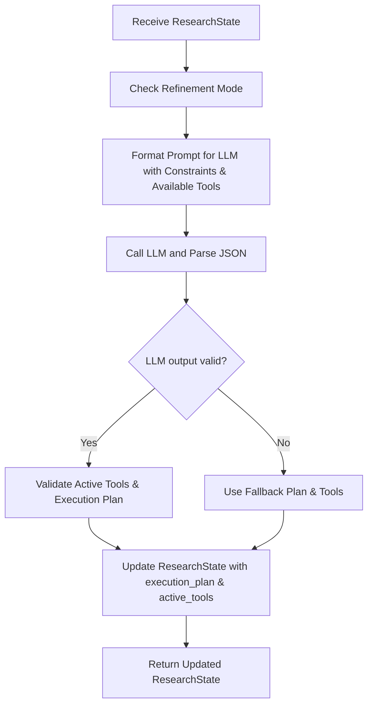
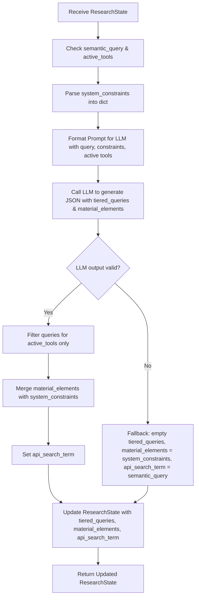
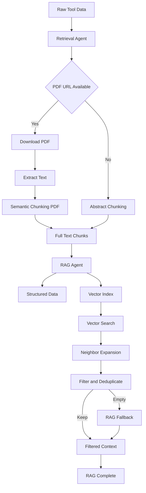
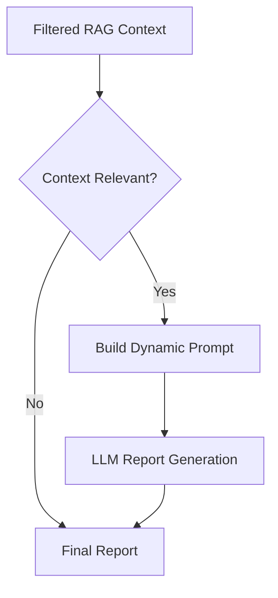
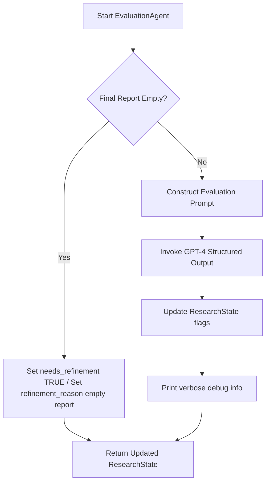

# Research Assistant MultiAgent Architecture

## 📖 Contents
- [System Architecture](#-system-srchitecture)
  - [High-Level Execution Flow](#-high-level-execution-flow)
    
- [ResearchState (Shared Workflow State)](#-researchstate-shared-workflow-state)
  - [State Categories](#-state-categories)
    - [User Input & Planning](#1️⃣-user-input--planning)
    - [Constraints & Query Structure](#2️⃣-constraints--query-structure)
    - [Tool Execution & Retrieval](#3️⃣-tool-execution--retrieval)
    - [RAG Pipeline](#4️⃣-rag-pipeline)
    - [Synthesis & Evaluation](#5️⃣-synthesis--evaluation)
    - [Control & Routing](#6️⃣-control--routing)
  - [State Lifecycle](#-state-lifecycle)

- [LangGraph Architecture Overview](#-langgraph-architecture-overview)
  - [High-Level Execution Flow](#-high-level-execution-flow)
  - [Core Concept](#-core-concept)
    - [Shared State](#1-shared-state-researchstate)
    - [Nodes (Agents)](#2-nodes-agents)
  - [Routing & Control Logic](#-routing--control-logic)
    - [route_from_supervisor](#route_from_supervisor)
    - [route_to_tools](#route_to_tools)
    - [route_next_tool](#route_next_tool-tool-loop-controller)
    - [route_after_evaluation](#route_after_evaluation)
  - [Tool Execution Loop Example](#-tool-execution-loop-example)
  - [Refinement Loop](#-refinement-loop)
  - [Design Benefits](#-design-benefits)
  - [Summary](#-summary)

- [Detailed Overview of Each and Every Agent](#detailed-overview-of-each-and-every-agent)
  - [CleanQueryAgent](#cleanqueryagent) 
  - [IntentAgent](#intentagent)
  - [PlanningAgent](#planningagent)
  - [QueryGenerationAgent](#querygenerationagent) 
  - [Tool Agents (`tool_agents.py`)](#-tool-agents-tool_agentspy)
    - [BaseToolAgent](#basetoolagent)
      - [Purpose](#-purpose)
      - [Inputs (from ResearchState)](#-inputs-from-researchstate)
      - [Outputs (to ResearchState)](#-outputs-to-researchstate)
    - [PubMedAgent](#pubmedagent)
      - [Tiered Search](#-tiered-search)
      - [Metadata Fetch & URL Construction](#-metadata-fetch--url-construction)
      - [Inputs](#-inputs)
      - [Outputs](#-outputs)
      - [Execution Flow](#-execution-flow)
    - [ArxivAgent](#arxivagent)
      - [Time Constraints](#-time-constraints)
      - [Tiered Search](#-tiered-search-1)
      - [Standardization of Results](#-standardization-of-results)
      - [Inputs](#-inputs-1)
      - [Outputs](#-outputs-1)
      - [Execution Flow](#-execution-flow-1)
    - [OpenAlexAgent](#openalexagent)
      - [API Call & Query Handling](#-api-call--query-handling)
      - [Abstract Reconstruction](#-abstract-reconstruction)
      - [Standardization of Results](#-standardization-of-results-1)
      - [Inputs](#-inputs-2)
      - [Outputs](#-outputs-2)
      - [Execution Flow](#-execution-flow-2)
    - [MaterialsAgent](#materialsagent)
      - [API Query & Validation](#-api-query--validation)
      - [Standardization of Material Data](#-standardization-of-material-data)
      - [Inputs](#-inputs-3)
      - [Outputs](#-outputs-3)
      - [Execution Flow](#-execution-flow-3)
    - [WebAgent](#webagent)
      - [DuckDuckGo Search Integration](#-duckduckgo-search-integration)
      - [Standardization of Results](#-standardization-of-results-2)
      - [Inputs](#-inputs-4)
      - [Outputs](#-outputs-4)
      - [Execution Flow](#-execution-flow-4)
  - [Retrieval & RAG Pipeline](#-retrieval--rag-pipeline)
    - [RetrievalAgent](#-retrievalagent)
    - [RAGAgent](#-ragagent)
    - [RAG Processing Stages](#rag-processing-stages)
  - [SynthesisAgent](#-synthesisagent)
    - [Purpose](#-purpose-1)
    - [Inputs (from ResearchState)](#-inputs-from-researchstate-1)
    - [Outputs (written to ResearchState)](#-outputs-written-to-researchstate)
    - [Internal Responsibilities](#-internal-responsibilities)
    - [Refinement Mode (Critical Feature)](#-refinement-mode-critical-feature)
    - [Execution Flow](#-execution-flow-5)
    - [Failure Handling](#-failure-handling)
    - [Summary](#-summary-1)
  - [EvaluationAgent](#-evaluationagent)
    - [EvaluationSchema](#-evaluationschema)
    - [Purpose & Responsibility](#purpose--responsibility)
    - [Inputs & Outputs](#inputs--outputs)
    - [Execution Flow](#-execution-flow-6)
    - [Failure Handling](#failure-handling-1)
    - [Debug & Logging](#debug--logging)


---
# 🔬 Advanced Multi-Agent Research Framework
---
This framework implements a state-driven, autonomous research pipeline using LangGraph. It coordinates specialized agents to perform deep-dive scientific literature reviews, material property analysis, and factual synthesis with an integrated evaluation-refinement loop.

## 🗺️ System Architecture
The architecture is built on a Supervisor-Worker pattern. The Supervisor manages the lifecycle of a request, while specialized agents handle specific phases of the research.

## 🔄 High-Level Execution Flow
1. **Planning Phase:** The query is cleaned, intent is classified, and a dynamic execution plan is generated.
2. **Tool Orchestration:** Active tools (PubMed, ArXiv, etc.) are executed sequentially.
3. **RAG Pipeline:** Raw data is downloaded, converted to full-text, chunked, and indexed for semantic search.
4. **Synthesis:** A structured report is generated, grounded in the retrieved citations.
5. **Quality Gate:** The Evaluation Agent audits the report. If gaps exist, it triggers a Refinement Loop.

---
## 🧠 ResearchState (Shared Workflow State)

ResearchState is the central shared memory used by all agents in the LangGraph workflow.
Each agent reads from and writes to this state to coordinate planning, tool execution, retrieval, synthesis, and evaluation.

It is implemented as a TypedDict to provide structure, clarity, and type safety.

### 🔹 State Categories
The state is logically grouped into six categories:

**1️⃣ User Input & Planning**

| Field            | Type        | Description                                    |
| ---------------- | ----------- | ---------------------------------------------- |
| `user_query`     | `str`       | Original user input                            |
| `semantic_query` | `str`       | Cleaned and normalized query                   |
| `primary_intent` | `str`       | Classified intent (e.g., material, biomedical) |
| `execution_plan` | `List[str]` | High-level execution plan                      |


**2️⃣ Constraints & Query Structure**

| Field                | Type                        | Description                                         |
| -------------------- | --------------------------- | --------------------------------------------------- |
| `system_constraints` | `List[str]`                 | Stable structured constraints (time, scope, domain) |
| `material_elements`  | `List[str]`                 | Merged constraints and extracted elements           |
| `api_search_term`    | `str`                       | Canonical search term for structured APIs           |
| `tiered_queries`     | `Dict[str, Dict[str, str]]` | Strict / moderate / broad tool queries              |
| `active_tools`       | `List[str]`                 | Tools selected for execution                        |


**3️⃣ Tool Execution & Retrieval**

| Field           | Type                   | Description                           |
| --------------- | ---------------------- | ------------------------------------- |
| `raw_tool_data` | `List[Dict[str, Any]]` | Aggregated raw outputs from all tools |
| `references`    | `List[str]`            | Collected citations                   |


**4️⃣ RAG Pipeline**

| Field              | Type                   | Description                         |
| ------------------ | ---------------------- | ----------------------------------- |
| `full_text_chunks` | `List[Dict[str, Any]]` | Extracted and chunked document text |
| `filtered_context` | `str`                  | Context passed to synthesis         |
| `rag_complete`     | `Optional[bool]`       | Indicates RAG completion            |


**5️⃣ Synthesis & Evaluation**

| Field               | Type   | Description               |
| ------------------- | ------ | ------------------------- |
| `final_report`      | `str`  | Generated research report |
| `report_generated`  | `bool` | Synthesis completion flag |
| `needs_refinement`  | `bool` | Evaluation decision flag  |
| `refinement_reason` | `str`  | Reason for refinement     |


**6️⃣ Control & Routing**

| Field         | Type   | Description                        |
| ------------- | ------ | ---------------------------------- |
| `is_refining` | `bool` | Indicates refinement loop          |
| `next`        | `str`  | Routing key used by the Supervisor |


### 🔁 State Lifecycle

1. Supervisor initializes state
2. Planning agents progressively enrich it
3. Tool agents append raw data
4. RAG agents filter and compress context
5. Synthesis writes the final report
6. Evaluation decides termination or refinement

The state persists across refinement loops, allowing iterative improvement without data loss.


---
## 🧠 LangGraph Architecture Overview
**graph.py**
This project implements a Supervisor-driven, multi-agent research workflow using LangGraph.
The system is designed as a state machine that coordinates planning, tool execution, retrieval-augmented generation (RAG), synthesis, and evaluation with optional refinement loops.

### 🔁 High-Level Execution Flow



### 🧩 Core Concept
**1.** Shared State (ResearchState)
- All agents operate on a shared memory object called ResearchState.
- Each agent reads from and writes to this state
- Routing decisions are based entirely on state values
- This makes execution transparent, debuggable, and reproducible


**2.** Nodes (Agents)

Each node in the graph is an agent that performs a single responsibility:
| Agent                | Responsibility                                   |
| -------------------- | ------------------------------------------------ |
| SupervisorAgent      | Controls execution flow and refinement loops     |
| CleanQueryAgent      | Normalizes and cleans user input                 |
| IntentAgent          | Identifies primary intent and constraints        |
| PlanningAgent        | Creates a high-level execution plan              |
| QueryGenerationAgent | Builds structured tool queries                   |
| Tool Agents          | Execute external searches (PubMed, Arxiv, etc.)  |
| RetrievalAgent       | Aggregates tool outputs                          |
| RAGAgent             | Filters and chunks relevant context              |
| SynthesisAgent       | Produces the final report                        |
| EvaluationAgent      | Evaluates output quality and triggers refinement |


## 🚦 Routing & Control Logic

The graph uses conditional edges (routers) to dynamically control execution.
Few important functions which were utilized inside the LangGraph assembly code block, are provided blow:
1. **route_from_supervisor**
Determines where execution begins or resumes.
- Reads state["next_node"]
- Routes to:
  1. clean_query_agent (fresh run)
  2. rag_filter (refinement loop)

2. **route_to_tools**
Determines which tool to start with after query generation.
- Reads state["active_tools"]
- Returns the first eligible tool node
- Only one tool is selected at this stage

3. **route_next_tool** (Tool Loop Controller)
- Controls sequential tool execution.
- Receives:(input arguments)
  - The tool that just executed
  - The shared state
  - Uses a fixed tool order:
```python
pubmed → arxiv → openalex → materials → web
```
- Routes to:
  - The next enabled tool, OR
  - retrieve_data when tool execution is complete
- This ensures:
  - Deterministic ordering
  - No repeated tools
  - No infinite loops
    
#### Why Lambdas Are Used (inside the route_next_tool function)
LangGraph routers only receive state.
They do not receive information about which node just ran.
Each tool node therefore uses a lambda to ***bind its identity***:
```python
lambda state, key=tool_key: route_next_tool(key, state)
```
This allows route_next_tool to know which tool just executed.

4. **route_after_evaluation**
Determines whether the workflow should:
- End execution, or Loop back to the Supervisor for refinement
- Decision is based on state["needs_refinement"].

### 🔄 Tool Execution Loop (Example)
```python
If:

active_tools = ["pubmed", "arxiv", "web"]

Execution order will be:

query_gen_agent
 → pubmed_search
 → arxiv_search
 → web_search
 → retrieve_data

Only selected tools are executed, in a controlled order.
```
### 🧪 Refinement Loop
After synthesis:
The EvaluationAgent checks output quality -> If refinement is required -> Control returns to the Supervisor

The Supervisor decides the next step
- If acceptable:
   - Execution terminates
This allows iterative improvement without restarting the entire workflow.

### ✅ Design Benefits
Supervisor-controlled orchestration
- Deterministic tool execution
- Explicit, inspectable state
- Safe refinement loops
- Easy to extend with new tools or agents
- Production-ready architecture

### 🧠 Summary
**This LangGraph architecture models research as a controlled, state-driven process, combining:**
- Planning
- Tool orchestration
- Retrieval-augmented generation
- Evaluation and refinement
- The result is a transparent, debuggable, and scalable multi-agent system.

---


---

# Detailed overview of each and every agents
--------------------------------------------

---

## CleanQueryAgent
**File:** `procedural_agent.py`  
**Agent ID:** `clean_query_agent`

### Purpose
The **CleanQueryAgent** is responsible for **preprocessing the raw user query** and generating a normalized **semantic query**.  
It ensures the query is clean, consistent, and suitable for downstream LLM-based agents such as `IntentAgent` and `PlanningAgent`.

This agent operates **before all LLM-driven agents** and provides a stable starting point for the research workflow.

### Inputs
- `user_query` (string)  
  Raw user-provided query from the initial request.

### Outputs
- `user_query` (string)  
  Cleaned version of the original query.
- `semantic_query` (string)  
  Normalized semantic query used by downstream agents.

Both fields are written back to `ResearchState`.

### Responsibilities

- Trim leading/trailing whitespace.
- Collapse multiple spaces into a single space.
- Remove non-semantic punctuation (`? ! ( ) [ ] " ' *`).
- Normalize separators (e.g., replace `--` with space).
- Generate a **semantic query** (currently identical to cleaned query, extensible for future NLP logic).

### Execution Flow


---

# IntentAgent

**Purpose:**  
Determines the primary intent of the user query and extracts structured constraints. Outputs to `ResearchState`.

**Inputs:**  
- `semantic_query` (string) — the user's research query.

**Outputs:**  
- `primary_intent` (string) — chosen intent from predefined options.  
- `system_constraints` (list of strings) — structured constraints extracted.  
- `material_elements` (list) — initialized empty for later agents.

### Execution Flow



---

## PlanningAgent

**Purpose:**  
Generates a step-by-step execution plan and dynamically selects active tools based on the user's intent, query, and constraints. Handles **refinement logic** if previous execution attempts failed, ensuring failed tools are deactivated and alternatives are activated.

### Inputs

- `primary_intent` (string) — The main goal of the research query (from `IntentAgent`).  
- `semantic_query` (string) — The user's research query.  
- `system_constraints` (list of strings) — Extracted constraints.  
- Optional (for refinement):  
  - `is_refining` (bool) — Indicates if this is a refinement attempt.  
  - `refinement_reason` (string) — Reason for previous execution failure.

### Outputs

- `execution_plan` (list of strings) — Step-by-step plan for research execution.  
- `active_tools` (list of strings) — Subset of tools selected for this query (e.g., `["arxiv", "openalex", "web"]`).

### Execution Flow


### QueryGenerationAgent

**Purpose:**  
Generates **tiered, tool-specific search queries** and extracts relevant chemical/material elements from the user's query. Ensures queries are only created for **active tools** and handles refinement instructions for problematic tools (e.g., ArXiv category adjustment).

### Inputs
- `semantic_query` (string) — The user's research query.  
- `active_tools` (list of strings) — Tools selected by `PlanningAgent`.  
- `system_constraints` (list of strings) — Extracted constraints from `IntentAgent`.  

### Outputs
- `tiered_queries` (dict) — Tiered search queries per tool. Example structure:

```json
{
    "pubmed": {"strict": "...", "moderate": "...", "broad": "..."},
    "arxiv": {"strict": "...", "moderate": "...", "broad": "..."},
    "openalex": {"simple": "..."},
    "web": {"simple": "..."}
}
```
material_elements (list of strings) 
— Includes most specific chemical formula first, followed by individual elements.

api_search_term (string) 
— Primary search term for API calls (first element in material_elements if available, otherwise semantic_query).

### Execution Flow


### Notes
- Tiered Queries: PubMed and ArXiv have strict, moderate, broad tiers; OpenAlex and Web use simple.
- Material Extraction: Ensures the primary formula appears first, followed by constituent elements.
- ArXiv Special Handling: Removes previous restrictive category filters and ignores date keywords to improve coverage.
- Refinement Handling: Skips queries for deactivated tools and adjusts tier instructions if necessary.

---

---------------------------------
# 🧰 Tool Agents (`tool_agents.py`)

This module contains all **tool-specific agents** used in the LangGraph workflow.  
Each agent inherits from `BaseToolAgent` and implements its own retrieval logic while following common guardrails.

---------------------------
### BaseToolAgent

#### 🎯 Purpose
Abstract base class for all tool agents. Provides:

- Tool activation checks (`_should_run()`)
- Tiered query retrieval (`_get_query_data()`)
- Tool key extraction (`_get_tool_key()`)
- Standardized execution interface (`execute(state)`)

#### 🔌 Inputs (from ResearchState)

| Field             | Type                        | Description                            |
| ----------------- | --------------------------- | -------------------------------------- |
| `active_tools`    | `List[str]`                 | List of enabled tools                  |
| `tiered_queries`  | `Dict[str, Dict[str, str]]` | Tool-specific queries (strict/moderate/broad) |
| `api_search_term` | `str`                       | Used for structured API tools (e.g., Materials) |

#### 📤 Outputs (to ResearchState)

| Field            | Type                   | Description                                   |
| ---------------- | --------------------- | --------------------------------------------- |
| `raw_tool_data`  | `List[Dict[str, Any]]` | Appended tool results                        |
| `references`     | `List[str]`            | Formatted citations for synthesis            |


---------------------------
### PubMedAgent

#### 🎯 Purpose
Fetches biomedical literature via PubMed API using tiered queries.

#### 🔹 Tiered Search
- Executes queries in order: **strict → moderate → broad**
- Stops after retrieving relevant results
- Uses Entrez email for API access

#### 🔹 Metadata Fetch & URL Construction
- Retrieves abstracts, authors, journal, publication date
- Constructs canonical PubMed URLs: `https://pubmed.ncbi.nlm.nih.gov/{pmid}/`

#### 🔌 Inputs

| Field            | Type                        | Description                     |
| ---------------- | --------------------------- | ------------------------------- |
| `tiered_queries` | `Dict[str, Dict[str, str]]` | PubMed query strings            |

#### 📤 Outputs

| Field           | Type                   | Description                        |
| --------------- | --------------------- | ---------------------------------- |
| `raw_tool_data` | `List[Dict[str, Any]]` | Standardized article metadata + text |
| `references`    | `List[str]`            | Formatted citations               |

#### 🔄 Execution Flow
1. Check `_should_run()`
2. Execute `_execute_tiered_search()`
3. Fetch metadata via `_fetch_metadata_for_pmids()`
4. Append results to `raw_tool_data` and `references`

---------------------------

### ArxivAgent

#### 🎯 Purpose
Fetches preprints from Arxiv and optionally filters by publication time.

#### 🔹 Time Constraints
- Filters results based on `TIME_PERIOD` from `system_constraints`
- Defaults to last 10 years if unspecified

#### 🔹 Tiered Search
- Executes queries in order: **strict → moderate → broad**
- Calls `_call_arxiv_search()` via Arxiv API

#### 🔹 Standardization of Results
- Truncates abstracts to 500 characters
- Includes metadata: title, authors, published year, PDF URL

#### 🔌 Inputs

| Field                 | Type                        | Description                     |
| --------------------- | --------------------------- | ------------------------------- |
| `tiered_queries`      | `Dict[str, Dict[str, str]]` | Arxiv query strings             |
| `system_constraints`  | `List[str]`                 | Optional time filters           |

#### 📤 Outputs

| Field           | Type                   | Description                        |
| --------------- | --------------------- | ---------------------------------- |
| `raw_tool_data` | `List[Dict[str, Any]]` | Standardized abstracts + metadata  |
| `references`    | `List[str]`            | Formatted citations               |

#### 🔄 Execution Flow
1. Check `_should_run()`
2. Prepare tiered queries
3. Apply time filter if specified
4. Call Arxiv API
5. Standardize results and update `raw_tool_data` and `references`

---------------------------

### OpenAlexAgent

#### 🎯 Purpose
Fetches scholarly works from OpenAlex with structured metadata.

#### 🔹 API Call & Query Handling
- Calls OpenAlex API using `title.search`
- Requires `OPENALEX_EMAIL` for API usage

#### 🔹 Abstract Reconstruction
- Handles inverted index abstracts
- Robustly reconstructs abstracts even if indices are incomplete

#### 🔹 Standardization of Results
- Builds structured dictionaries:
  - `text`, `metadata`, `tool_id`, `openalex_id`

#### 🔌 Inputs

| Field            | Type                        | Description                     |
| ---------------- | --------------------------- | ------------------------------- |
| `tiered_queries` | `Dict[str, Dict[str, str]]` | OpenAlex query strings          |

#### 📤 Outputs

| Field           | Type                   | Description                        |
| --------------- | --------------------- | ---------------------------------- |
| `raw_tool_data` | `List[Dict[str, Any]]` | Standardized work metadata + text |
| `references`    | `List[str]`            | Formatted citations               |

#### 🔄 Execution Flow
1. Check `_should_run()`
2. Retrieve tiered query
3. Call `_call_openalex_api()`
4. Standardize results and update `raw_tool_data` and `references`

---------------------------

### MaterialsAgent

#### 🎯 Purpose
Queries the Materials Project API for material properties.

#### 🔹 API Query & Validation
- Uses `MPRester` for API calls
- Runs only if `api_search_term` is valid

#### 🔹 Standardization of Material Data
- Converts raw results to human-readable entries:
  - Stability status
  - Band gap (LaTeX)
  - Energy above hull (LaTeX)

#### 🔌 Inputs

| Field            | Type   | Description                  |
| ---------------- | ------ | ---------------------------- |
| `api_search_term` | `str` | Target material formula      |

#### 📤 Outputs

| Field           | Type                   | Description                  |
| --------------- | --------------------- | ---------------------------- |
| `raw_tool_data` | `List[Dict[str, Any]]` | Standardized material info   |
| `references`    | `List[str]`            | Materials Project citations |

#### 🔄 Execution Flow
1. Check `_should_run()`
2. Call `_call_materials_project_api()` with formula
3. Standardize via `_standardize_mp_results()`
4. Append results to `raw_tool_data` and `references`

---------------------------

### WebAgent

#### 🎯 Purpose
Performs general web search using DuckDuckGo for supplemental information.

#### 🔹 DuckDuckGo Search Integration
- Uses `DDGS()` client
- Selects tiered query (simple → broad)
- Falls back to `semantic_query` if no tool query exists

#### 🔹 Standardization of Results
- Structured dictionaries per result:
  - `text snippet`
  - `url`
  - `source metadata`

#### 🔌 Inputs

| Field            | Type   | Description                         |
| ---------------- | ------ | ----------------------------------- |
| `tiered_queries` | Dict   | Optional tool-specific queries      |
| `semantic_query` | str    | Fallback search term                |

#### 📤 Outputs

| Field           | Type                   | Description                 |
| --------------- | --------------------- | --------------------------- |
| `raw_tool_data` | `List[Dict[str, Any]]` | Structured web snippets    |
| `references`    | `List[str]`            | Web citations              |

#### 🔄 Execution Flow
1. Check `_should_run()`
2. Call `_call_ddg_search()`
3. Standardize results
4. Append to `raw_tool_data` and `references`
5. Warn if no results are found

   
---

## 📚 Retrieval & RAG Pipeline

This project uses a two-stage Retrieval-Augmented Generation (RAG) pipeline designed to be model-agnostic, scalable, and robust to heterogeneous data sources.
The pipeline consists of:
- 📥 **RetrievalAgent** – document downloading, text extraction, and semantic chunking
  The bridge between metadata and full text.
  - **PDF Worker:** Identifies pdf_url or PubMed links to download full papers.
  - **Semantic Chunking:** Breaks text into overlapping segments, ensuring that a paragraph describing a "Synthesis Method" isn't cut in half.
  - 
- 🔎 **RAGAgent**(The filter) – vector search, **contextual expansion**, filtering, and final context assembly
  - **Vector DB:** Uses FAISS to index all chunks.
  - **Neighbor Expansion:** A standout feature. When a relevant chunk is found, the agent retrieves the chunk immediately before and after   it to provide the LLM with the full surrounding context.
  - **Keyword Gating:** Filters out academic boilerplate (e.g., "References", "Conflict of Interest") to save token space.

### 📥 RetrievalAgent
**Purpose**
The RetrievalAgent is responsible for converting raw tool outputs (PDFs, abstracts, snippets) into structured, semantically meaningful text chunks suitable for vector-based retrieval.

**Key Responsibilities**
- Download PDFs from tool outputs (e.g., Arxiv, PubMed)
- Extract full text from PDFs
- Perform semantic-first text chunking
- Provide fallback chunking for non-PDF sources
- Populate state["full_text_chunks"]

**Inputs (from ResearchState)**
| Field           | Type                   | Description                             |
| --------------- | ---------------------- | --------------------------------------- |
| `raw_tool_data` | `List[Dict[str, Any]]` | Aggregated outputs from all tool agents |

**Outputs (written to ResearchState)**
| Field              | Type                   | Description                            |
| ------------------ | ---------------------- | -------------------------------------- |
| `full_text_chunks` | `List[Dict[str, Any]]` | Structured, chunked text with metadata |

Each chunk contains:
```python
{
  "chunk_id": "tool_doc_hash_index",
  "doc_id": "source_url",
  "chunk_index": 0,
  "text": "...",
  "source": "tool_id",
  "url": "source_url"
}

```
**Chunking Strategy**
Sentence-aware semantic chunking
- Dynamic character limits (token-safe for most LLMs)
- Overlapping chunks for context continuity
- Hard splits for oversized sentences
This design is safe across OpenAI, Claude, Gemini, and other LLMs.

**Failure Handling**
- Gracefully skips failed PDF downloads
- Falls back to abstracts/snippets when full text is unavailable
- Ensures at least one placeholder chunk exists if retrieval fails


## 🔹 RAGAgent


**Purpose**
The RAGAgent filters and compresses retrieved content into a high-signal context window for synthesis, combining vector similarity, neighbor expansion, and keyword gating.

**Key Responsibilities**
- Index text chunks into a vector database
- Perform semantic vector search
- Expand context via neighboring chunks
- Preserve structured (non-vector) data
- Deduplicate and filter noise
- Assemble the final RAG context

**Inputs (from ResearchState)**
| Field              | Type                   | Description                                           |
| ------------------ | ---------------------- | ----------------------------------------------------- |
| `semantic_query`   | `str`                  | Query used for vector search                          |
| `api_search_term`  | `str`                  | Literal term used for keyword gating                  |
| `full_text_chunks` | `List[Dict[str, Any]]` | Chunked documents                                     |
| `raw_tool_data`    | `List[Dict[str, Any]]` | Includes structured data (e.g., materials properties) |

**Outputs (written to ResearchState)**
| Field              | Type   | Description                       |
| ------------------ | ------ | --------------------------------- |
| `filtered_context` | `str`  | Final context passed to synthesis |
| `rag_complete`     | `bool` | Indicates RAG stage completion    |


### RAG Processing Stages
1. Structured Context Preservation
    - Keeps non-textual, high-value data (e.g., materials properties)
    - Bypasses vector filtering
2. Vector Indexing
    - All valid chunks are indexed into the vector database
    - Index persists across refinement loops
3. Semantic Vector Search
    - Top-K similarity search (k = 8)
    - Distance-based thresholding
4. Neighbor Expansion
    - Expands results to adjacent chunks
    - Preserves local document context
5. Filtering & Deduplication
    - Keyword gating to remove academic boilerplate
    - Chunk-level deduplication
    - Hard cap on maximum chunks retained
6. Fallback Strategy
    - If filtering removes everything, raw chunks are used as backup

---

## ✍️ SynthesisAgent

The SynthesisAgent is responsible for generating the final scientific research report from the filtered RAG context and structured tool outputs.
It supports both initial report generation and refinement rewrites, driven entirely by state flags set earlier in the workflow.

This agent is LLM-driven, state-aware, citation-strict, and refinement-safe.

### 🎯 Purpose
The SynthesisAgent:
- Converts filtered RAG context into a structured scientific report
- Dynamically adapts report structure based on tool availability
- Enforces strict citation grounding
- Supports iterative refinement using evaluation feedback
- Includes context relevance guardrails to prevent garbage-in-garbage-out (GIGO)

### 🔌 Inputs (from ResearchState)
| Field               | Type                   | Description                               |
| ------------------- | ---------------------- | ----------------------------------------- |
| `semantic_query`    | `str`                  | Normalized user query                     |
| `execution_plan`    | `List[str]`            | High-level research plan                  |
| `filtered_context`  | `str`                  | RAG-filtered synthesis context            |
| `raw_tool_data`     | `List[Dict[str, Any]]` | Tool outputs (materials, literature, web) |
| `references`        | `List[str]`            | Collected citation strings                |
| `needs_refinement`  | `bool`                 | Indicates rewrite mode                    |
| `refinement_reason` | `str`                  | Evaluation feedback                       |
| `final_report`      | `str`                  | Previous report (for refinement)          |

### 📤 Outputs (written to ResearchState)
| Field              | Type   | Description                    |
| ------------------ | ------ | ------------------------------ |
| `final_report`     | `str`  | Generated or rewritten report  |
| `report_generated` | `bool` | Report generation success flag |
| `is_refining`      | `bool` | Indicates rewrite execution    |
| `needs_refinement` | `bool` | Reset after synthesis          |
| `next`             | `str`  | Routed back to `evaluation`    |

### 🧩 Internal Responsibilities
1️⃣ **Material Data Extraction**
```python
_extract_material_data()
```
- Extracts structured material properties from materials_agent
- Determines whether a materials-focused or literature-focused report should be generated
- Returns:
  - Material summary text
  - Target formula
  - Boolean presence flag
This drives dynamic report structure selection.

2️⃣ **Reference Formatting & Deduplication**
```python
_extract_references()
```
- Converts raw reference strings into numbered Markdown citations
- Resolves URLs using raw_tool_data metadata
- Supports:
  - PubMed
  - Arxiv
  - OpenAlex
  - Web sources
  - Materials Project references
Ensures:
  - Stable numbering
  - Deduplication
  - Markdown-safe output

3️⃣ **Context Relevance Guardrail (Anti-GIGO)**
```
_check_context_relevance()
```
***Used only on initial generation, not during refinement.***

If:
- Context is very short, or
- Appears weak or generic
Then the agent asks the LLM:
***“Is this context actually relevant to the user’s question?”***

If NO → the agent:
- Fails gracefully
- Writes a clear diagnostic message
- Skips hallucinated synthesis
This prevents meaningless reports.

4️⃣ **Dynamic Prompt Construction**
```python
_format_prompt()
```
The prompt is fully dynamic, adapting to:
| Condition                 | Behavior                           |
| ------------------------- | ---------------------------------- |
| Material data present     | Generates materials-centric report |
| No material data          | Generates literature review        |
| `needs_refinement = True` | Rewrites previous report           |
| Initial run               | Generates new report               |

5️⃣ **Enforced Report Structure**
Every report must contain exactly four sections:
```python
- Introduction / Stability Analysis
- Key Research Findings
- Conclusion and Future Outlook
- References
```
### 🔁 Refinement Mode (Critical Feature)

When state["needs_refinement"] == True:
- The agent becomes a report rewriting expert
Receives:
- Evaluation feedback
- Previous report
- Updated RAG context
Must:
- Address feedback explicitly
- Fix errors or omissions
- Preserve scientific tone
- Maintain citation correctness
Output:
- A single rewritten final report
- No commentary or explanation

### 🧪 Execution Flow


### 🚦 Failure Handling
| Scenario           | Behavior                     |
| ------------------ | ---------------------------- |
| Missing LLM client | Graceful failure message     |
| Irrelevant context | Abort with explanation       |
| No retrieved data  | Abort synthesis              |
| LLM error          | Error state with termination |

### 🧠 Summary
The SynthesisAgent is the final authority in the LangGraph workflow.
It converts structured retrieval into a grounded, citation-backed scientific report, while remaining:
- State-driven
- Evaluation-aware
- Refinement-safe
- Hallucination-resistant
It ensures the system produces credible research output, not just fluent text.

---

## 🧪 EvaluationAgent
------------------

The EvaluationAgent is responsible for assessing the SynthesisAgent’s final report against the dynamic execution plan and determining whether refinement is needed. It uses GPT-4 with a structured Pydantic schema to ensure reliable, boolean-based routing in the LangGraph workflow.

### 🎯 Purpose

*   Critically evaluate completeness, relevance, and factual correctness of the generated report.
    
*   Decide if the report requires refinement.
    
*   Provide a structured reason for any required refinements.
    
*   Maintain debug-friendly output for traceability and iterative workflows.
    

### 🔌 Inputs (from ResearchState)

FieldTypeDescriptionuser\_querystrOriginal query from the userexecution\_planList\[str\]High-level tasks the report should coverfinal\_reportstrSynthesized report from SynthesisAgent

### 📤 Outputs (written to ResearchState)

FieldTypeDescriptionneeds\_refinementboolTrue if the report fails to meet the execution plan; False otherwiserefinement\_reasonstrSpecific reason for refinement, or "Report is satisfactory" if no action neededreport\_generatedboolMarks that the report has been evaluated

### 🧩 Internal Responsibilities

1.  **Prompt Construction**Build a structured evaluation prompt including the user query, execution plan, and synthesized report.
    
2.  **Structured LLM Invocation**Use GPT-4 with EvaluationSchema to produce reliable boolean output.
    
3.  **State Update & Routing**Update ResearchState flags: needs\_refinement, refinement\_reason, and report\_generated.
    
4.  **Verbose Debugging**Print color-coded logs showing:
    
    *   Start of evaluation
        
    *   Empty report handling
        
    *   LLM evaluation results
        
    *   Post-evaluation state flags
        
    *   Execution plan length and report character count
        
5.  **Error Handling**Gracefully fall back to marking the report as complete if the LLM fails.
    

### 🔄 Execution Flow


### 🔄 Execution Flow
```python
class EvaluationSchema(BaseModel):
    """
    Schema for Evaluation Agent output to ensure reliable boolean routing.
    """
    needs_refinement: bool = Field(
        description="Set to TRUE if the final_report fails to address a key, actionable part of the execution plan. Otherwise, set to FALSE."
    )
    refinement_reason: str = Field(
        description="Specific reason why refinement is needed (e.g., 'Missing data on performance degradation'), or 'Report is satisfactory' if FALSE."
    )

```


