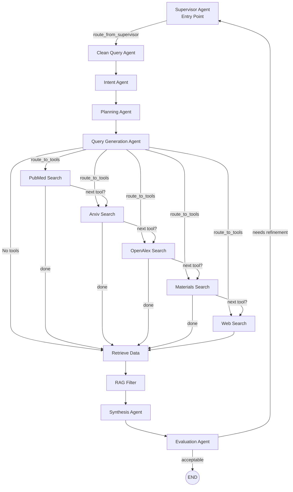
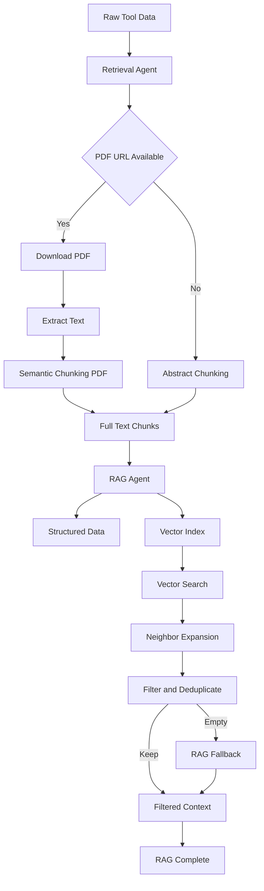

# Research Assistant MultiAgent Architectur

## 📖 Contents

- [🧠 ResearchState (Shared Workflow State)](#-researchstate-shared-workflow-state)
  - [State Categories](#-state-categories)
    - [User Input & Planning](#1️⃣-user-input--planning)
    - [Constraints & Query Structure](#2️⃣-constraints--query-structure)
    - [Tool Execution & Retrieval](#3️⃣-tool-execution--retrieval)
    - [RAG Pipeline](#4️⃣-rag-pipeline)
    - [Synthesis & Evaluation](#5️⃣-synthesis--evaluation)
    - [Control & Routing](#6️⃣-control--routing)
  - [State Lifecycle](#-state-lifecycle)

- [🧠 LangGraph Architecture Overview](#-langgraph-architecture-overview)
  - [High-Level Execution Flow](#-high-level-execution-flow)
  - [Core Concept](#-core-concept)
    - [Shared State](#1-shared-state-researchstate)
    - [Nodes (Agents)](#2-nodes-agents)
  - [Routing & Control Logic](#-routing--control-logic)
    - [route_from_supervisor](#route_from_supervisor)
    - [route_to_tools](#route_to_tools)
    - [route_next_tool](#route_next_tool-tool-loop-controller)
    - [route_after_evaluation](#route_after_evaluation)
  - [Tool Execution Loop Example](#-tool-execution-loop-example)
  - [Refinement Loop](#-refinement-loop)
  - [Design Benefits](#-design-benefits)
  - [Summary](#-summary)

- [📚 Retrieval & RAG Pipeline](#-retrieval--rag-pipeline)
  - [RetrievalAgent](#-retrievalagent)
  - [RAGAgent](#-ragagent)
  - [RAG Processing Stages](#rag-processing-stages)


---
## [🧠 ResearchState (Shared Workflow State)] (#-researchstate-shared-workflow-state)

ResearchState is the central shared memory used by all agents in the LangGraph workflow.
Each agent reads from and writes to this state to coordinate planning, tool execution, retrieval, synthesis, and evaluation.

It is implemented as a TypedDict to provide structure, clarity, and type safety.

### 🔹 State Categories
The state is logically grouped into six categories:

**1️⃣ User Input & Planning**

| Field            | Type        | Description                                    |
| ---------------- | ----------- | ---------------------------------------------- |
| `user_query`     | `str`       | Original user input                            |
| `semantic_query` | `str`       | Cleaned and normalized query                   |
| `primary_intent` | `str`       | Classified intent (e.g., material, biomedical) |
| `execution_plan` | `List[str]` | High-level execution plan                      |


**2️⃣ Constraints & Query Structure**

| Field                | Type                        | Description                                         |
| -------------------- | --------------------------- | --------------------------------------------------- |
| `system_constraints` | `List[str]`                 | Stable structured constraints (time, scope, domain) |
| `material_elements`  | `List[str]`                 | Merged constraints and extracted elements           |
| `api_search_term`    | `str`                       | Canonical search term for structured APIs           |
| `tiered_queries`     | `Dict[str, Dict[str, str]]` | Strict / moderate / broad tool queries              |
| `active_tools`       | `List[str]`                 | Tools selected for execution                        |


**3️⃣ Tool Execution & Retrieval**

| Field           | Type                   | Description                           |
| --------------- | ---------------------- | ------------------------------------- |
| `raw_tool_data` | `List[Dict[str, Any]]` | Aggregated raw outputs from all tools |
| `references`    | `List[str]`            | Collected citations                   |


**4️⃣ RAG Pipeline**

| Field              | Type                   | Description                         |
| ------------------ | ---------------------- | ----------------------------------- |
| `full_text_chunks` | `List[Dict[str, Any]]` | Extracted and chunked document text |
| `filtered_context` | `str`                  | Context passed to synthesis         |
| `rag_complete`     | `Optional[bool]`       | Indicates RAG completion            |


**5️⃣ Synthesis & Evaluation**

| Field               | Type   | Description               |
| ------------------- | ------ | ------------------------- |
| `final_report`      | `str`  | Generated research report |
| `report_generated`  | `bool` | Synthesis completion flag |
| `needs_refinement`  | `bool` | Evaluation decision flag  |
| `refinement_reason` | `str`  | Reason for refinement     |


**6️⃣ Control & Routing**

| Field         | Type   | Description                        |
| ------------- | ------ | ---------------------------------- |
| `is_refining` | `bool` | Indicates refinement loop          |
| `next`        | `str`  | Routing key used by the Supervisor |


### 🔁 State Lifecycle

1. Supervisor initializes state
2. Planning agents progressively enrich it
3. Tool agents append raw data
4. RAG agents filter and compress context
5. Synthesis writes the final report
6. Evaluation decides termination or refinement

The state persists across refinement loops, allowing iterative improvement without data loss.


---
## 🧠 LangGraph Architecture Overview
**graph.py**
This project implements a Supervisor-driven, multi-agent research workflow using LangGraph.
The system is designed as a state machine that coordinates planning, tool execution, retrieval-augmented generation (RAG), synthesis, and evaluation with optional refinement loops.

### 🔁 High-Level Execution Flow



### 🧩 Core Concept
**1.** Shared State (ResearchState)
- All agents operate on a shared memory object called ResearchState.
- Each agent reads from and writes to this state
- Routing decisions are based entirely on state values
- This makes execution transparent, debuggable, and reproducible


**2.** Nodes (Agents)

Each node in the graph is an agent that performs a single responsibility:
| Agent                | Responsibility                                   |
| -------------------- | ------------------------------------------------ |
| SupervisorAgent      | Controls execution flow and refinement loops     |
| CleanQueryAgent      | Normalizes and cleans user input                 |
| IntentAgent          | Identifies primary intent and constraints        |
| PlanningAgent        | Creates a high-level execution plan              |
| QueryGenerationAgent | Builds structured tool queries                   |
| Tool Agents          | Execute external searches (PubMed, Arxiv, etc.)  |
| RetrievalAgent       | Aggregates tool outputs                          |
| RAGAgent             | Filters and chunks relevant context              |
| SynthesisAgent       | Produces the final report                        |
| EvaluationAgent      | Evaluates output quality and triggers refinement |


## 🚦 Routing & Control Logic

The graph uses conditional edges (routers) to dynamically control execution.
**route_from_supervisor**
Determines where execution begins or resumes.
- Reads state["next_node"]
- Routes to:
  1. clean_query_agent (fresh run)
  2. rag_filter (refinement loop)

**route_to_tools**
Determines which tool to start with after query generation.
- Reads state["active_tools"]
- Returns the first eligible tool node
- Only one tool is selected at this stage

**route_next_tool** (Tool Loop Controller)
- Controls sequential tool execution.
- Receives:(input arguments)
  - The tool that just executed
  - The shared state
  - Uses a fixed tool order:
```python
pubmed → arxiv → openalex → materials → web
```
- Routes to:
  - The next enabled tool, OR
  - retrieve_data when tool execution is complete
- This ensures:
  - Deterministic ordering
  - No repeated tools
  - No infinite loops
    
#### Why Lambdas Are Used
LangGraph routers only receive state.
They do not receive information about which node just ran.
Each tool node therefore uses a lambda to ***bind its identity***:
```python
lambda state, key=tool_key: route_next_tool(key, state)
```
This allows route_next_tool to know which tool just executed.

**route_after_evaluation**
Determines whether the workflow should:
- End execution, or Loop back to the Supervisor for refinement
- Decision is based on state["needs_refinement"].

### 🔄 Tool Execution Loop (Example)
```python
If:

active_tools = ["pubmed", "arxiv", "web"]

Execution order will be:

query_gen_agent
 → pubmed_search
 → arxiv_search
 → web_search
 → retrieve_data

Only selected tools are executed, in a controlled order.
```
### 🧪 Refinement Loop
After synthesis:
The EvaluationAgent checks output quality -> If refinement is required -> Control returns to the Supervisor

The Supervisor decides the next step
- If acceptable:
   - Execution terminates
This allows iterative improvement without restarting the entire workflow.

### ✅ Design Benefits
Supervisor-controlled orchestration
- Deterministic tool execution
- Explicit, inspectable state
- Safe refinement loops
- Easy to extend with new tools or agents
- Production-ready architecture

### 🧠 Summary
**This LangGraph architecture models research as a controlled, state-driven process, combining:**
- Planning
- Tool orchestration
- Retrieval-augmented generation
- Evaluation and refinement
- The result is a transparent, debuggable, and scalable multi-agent system.

---


---

## 📚 Retrieval & RAG Pipeline

This project uses a two-stage Retrieval-Augmented Generation (RAG) pipeline designed to be model-agnostic, scalable, and robust to heterogeneous data sources.
The pipeline consists of:
- RetrievalAgent – document downloading, text extraction, and semantic chunking
- RAGAgent – vector search, contextual expansion, filtering, and final context assembly

### 🔹 RetrievalAgent
**Purpose**
The RetrievalAgent is responsible for converting raw tool outputs (PDFs, abstracts, snippets) into structured, semantically meaningful text chunks suitable for vector-based retrieval.

**Key Responsibilities**
- Download PDFs from tool outputs (e.g., Arxiv, PubMed)
- Extract full text from PDFs
- Perform semantic-first text chunking
- Provide fallback chunking for non-PDF sources
- Populate state["full_text_chunks"]

**Inputs (from ResearchState)**
| Field           | Type                   | Description                             |
| --------------- | ---------------------- | --------------------------------------- |
| `raw_tool_data` | `List[Dict[str, Any]]` | Aggregated outputs from all tool agents |

**Outputs (written to ResearchState)**
| Field              | Type                   | Description                            |
| ------------------ | ---------------------- | -------------------------------------- |
| `full_text_chunks` | `List[Dict[str, Any]]` | Structured, chunked text with metadata |

Each chunk contains:
```python
{
  "chunk_id": "tool_doc_hash_index",
  "doc_id": "source_url",
  "chunk_index": 0,
  "text": "...",
  "source": "tool_id",
  "url": "source_url"
}

```
**Chunking Strategy**
Sentence-aware semantic chunking
- Dynamic character limits (token-safe for most LLMs)
- Overlapping chunks for context continuity
- Hard splits for oversized sentences
This design is safe across OpenAI, Claude, Gemini, and other LLMs.

**Failure Handling**
- Gracefully skips failed PDF downloads
- Falls back to abstracts/snippets when full text is unavailable
- Ensures at least one placeholder chunk exists if retrieval fails


## 🔹 RAGAgent


**Purpose**
The RAGAgent filters and compresses retrieved content into a high-signal context window for synthesis, combining vector similarity, neighbor expansion, and keyword gating.

**Key Responsibilities**
- Index text chunks into a vector database
- Perform semantic vector search
- Expand context via neighboring chunks
- Preserve structured (non-vector) data
- Deduplicate and filter noise
- Assemble the final RAG context

**Inputs (from ResearchState)**
| Field              | Type                   | Description                                           |
| ------------------ | ---------------------- | ----------------------------------------------------- |
| `semantic_query`   | `str`                  | Query used for vector search                          |
| `api_search_term`  | `str`                  | Literal term used for keyword gating                  |
| `full_text_chunks` | `List[Dict[str, Any]]` | Chunked documents                                     |
| `raw_tool_data`    | `List[Dict[str, Any]]` | Includes structured data (e.g., materials properties) |

**Outputs (written to ResearchState)**
| Field              | Type   | Description                       |
| ------------------ | ------ | --------------------------------- |
| `filtered_context` | `str`  | Final context passed to synthesis |
| `rag_complete`     | `bool` | Indicates RAG stage completion    |


### RAG Processing Stages (#rag-processing-stages)
1. Structured Context Preservation
    - Keeps non-textual, high-value data (e.g., materials properties)
    - Bypasses vector filtering
2. Vector Indexing
    - All valid chunks are indexed into the vector database
    - Index persists across refinement loops
3. Semantic Vector Search
    - Top-K similarity search (k = 8)
    - Distance-based thresholding
4. Neighbor Expansion
    - Expands results to adjacent chunks
    - Preserves local document context
5. Filtering & Deduplication
    - Keyword gating to remove academic boilerplate
    - Chunk-level deduplication
    - Hard cap on maximum chunks retained
6. Fallback Strategy
    - If filtering removes everything, raw chunks are used as backup

---


