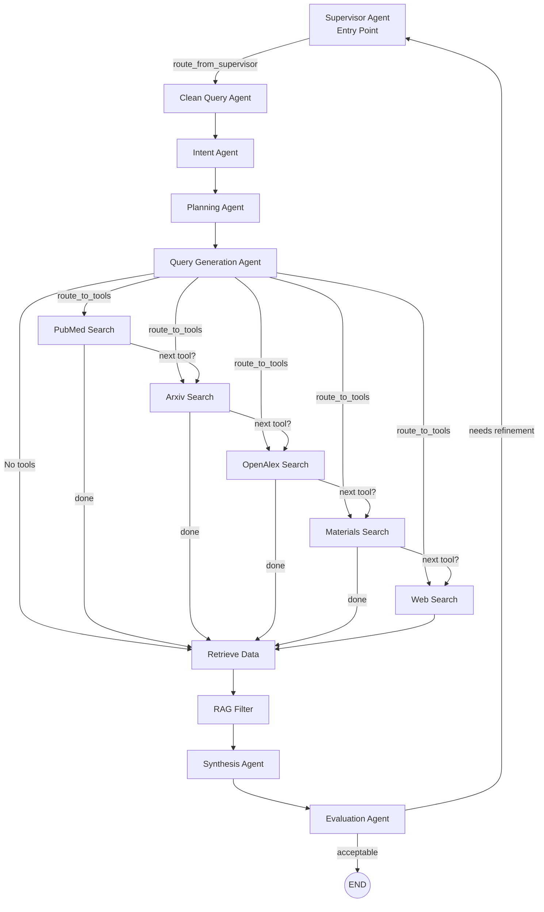

# Research Assistant MultiAgent Architectur

---
## 🧠 LangGraph Architecture Overview
**graph.py**
This project implements a Supervisor-driven, multi-agent research workflow using LangGraph.
The system is designed as a state machine that coordinates planning, tool execution, retrieval-augmented generation (RAG), synthesis, and evaluation with optional refinement loops.

### 🔁 High-Level Execution Flow



### 🧩 Core Concept
**1.** Shared State (ResearchState)
- All agents operate on a shared memory object called ResearchState.
- Each agent reads from and writes to this state
- Routing decisions are based entirely on state values
- This makes execution transparent, debuggable, and reproducible


**2.** Nodes (Agents)

Each node in the graph is an agent that performs a single responsibility:
| Agent                | Responsibility                                   |
| -------------------- | ------------------------------------------------ |
| SupervisorAgent      | Controls execution flow and refinement loops     |
| CleanQueryAgent      | Normalizes and cleans user input                 |
| IntentAgent          | Identifies primary intent and constraints        |
| PlanningAgent        | Creates a high-level execution plan              |
| QueryGenerationAgent | Builds structured tool queries                   |
| Tool Agents          | Execute external searches (PubMed, Arxiv, etc.)  |
| RetrievalAgent       | Aggregates tool outputs                          |
| RAGAgent             | Filters and chunks relevant context              |
| SynthesisAgent       | Produces the final report                        |
| EvaluationAgent      | Evaluates output quality and triggers refinement |


## 🚦 Routing & Control Logic

The graph uses conditional edges (routers) to dynamically control execution.
**route_from_supervisor**
Determines where execution begins or resumes.
- Reads state["next_node"]
- Routes to:
  1. clean_query_agent (fresh run)
  2. rag_filter (refinement loop)

**route_to_tools**
Determines which tool to start with after query generation.
- Reads state["active_tools"]
- Returns the first eligible tool node
- Only one tool is selected at this stage

**route_next_tool** (Tool Loop Controller)
- Controls sequential tool execution.
- Receives:(input arguments)
  - The tool that just executed
  - The shared state
  - Uses a fixed tool order:
```python
pubmed → arxiv → openalex → materials → web
```
- Routes to:
  - The next enabled tool, OR
  - retrieve_data when tool execution is complete
- This ensures:
  - Deterministic ordering
  - No repeated tools
  - No infinite loops
    
#### Why Lambdas Are Used
LangGraph routers only receive state.
They do not receive information about which node just ran.
Each tool node therefore uses a lambda to ***bind its identity***:
```python
lambda state, key=tool_key: route_next_tool(key, state)
```
This allows route_next_tool to know which tool just executed.

**route_after_evaluation**
Determines whether the workflow should:
- End execution, or Loop back to the Supervisor for refinement
- Decision is based on state["needs_refinement"].

### 🔄 Tool Execution Loop (Example)
```python
If:

active_tools = ["pubmed", "arxiv", "web"]

Execution order will be:

query_gen_agent
 → pubmed_search
 → arxiv_search
 → web_search
 → retrieve_data

Only selected tools are executed, in a controlled order.
```
### 🧪 Refinement Loop
After synthesis:
The EvaluationAgent checks output quality -> If refinement is required -> Control returns to the Supervisor

The Supervisor decides the next step
- If acceptable:
   - Execution terminates
This allows iterative improvement without restarting the entire workflow.

### ✅ Design Benefits
Supervisor-controlled orchestration
- Deterministic tool execution
- Explicit, inspectable state
- Safe refinement loops
- Easy to extend with new tools or agents
- Production-ready architecture

### 🧠 Summary
**This LangGraph architecture models research as a controlled, state-driven process, combining:**
- Planning
- Tool orchestration
- Retrieval-augmented generation
- Evaluation and refinement
- The result is a transparent, debuggable, and scalable multi-agent system.

