<div align="center">

  # 🔬 Advanced Multi-Agent Research Framework(GEN-AI)
  ## (🧠 Declarative Research Agent)
  **Autonomous AI agent for scientific literature discovery**

  
  
  

</div>

<div align="center">
  

</div>

---
<a id="table"></a>
## 📖 Table of Contents
- [Architecture Overview](#architecture-overview)
- [Installation and Setup](#installation)
- [Frontend Interface](#-frontend-interface-streamlit-ui)
  - [UI Architecture & Design Philosophy](#ui-architecture--design-philosophy)
  - [Layout System](#-layout-system)
  - [Component Breakdown](#-component-breakdown)
  - [State Management](#-state-management)
  - [API Integration](#-api-integration)
  - [Styling System](#-styling-system)
- [The Request Journey: Frontend to Backend](#the-request-journey-frontend-to-backend)
  - [Data Flow & Database Trigger Points](#-data-flow--database-trigger-points)
  - [Execution Architecture Diagram](#-execution-architecture-diagram)
  - [Key Design Principles](#-key-design-principles)
- [Backend Architecture](#backend-architecture)
  - [High-Level Component Flow](#-high-level-component-flow)
  - [Database Schema](#-database-schema-chat_historydb)
  - [Key Backend Functions](#-key-backend-functions)
  - [API Endpoints Summary](#-api-endpoints-summary)
- [Advanced Multi-Agent Research Framework](#-advanced-multi-agent-research-framework)
  - [System Architecture](#-system-architecture)
  - [High-Level Execution Flow](#-high-level-execution-flow)
- [ResearchState (Shared Workflow State)](#-researchstate-shared-workflow-state)
  - [State Categories](#-state-categories)
  - [State Lifecycle](#-state-lifecycle)
- [LangGraph Architecture Overview](#-langgraph-architecture-overview)
  - [Core Concept](#-core-concept)
  - [Routing & Control Logic](#-routing--control-logic)
  - [Tool Execution Loop Example](#-tool-execution-loop-example)
  - [Refinement Loop](#-refinement-loop)
  - [Design Benefits](#-design-benefits)
- [Detailed Agent Overview](#detailed-agent-overview)
  - [CleanQueryAgent](#cleanqueryagent)
  - [IntentAgent](#intentagent)
  - [PlanningAgent](#planningagent)
  - [QueryGenerationAgent](#querygenerationagent)
  - [Tool Agents](#-tool-agents-tool_agentspy)
  - [Retrieval & RAG Pipeline](#-retrieval--rag-pipeline)
  - [SynthesisAgent](#-synthesisagent)
  - [EvaluationAgent](#-evaluationagent)
- [Main Loop Execution & Management](#-main-loop-execution--management)
  - [Session Initialization](#-1-session-initialization)
  - [The Initial State](#-2-the-initial-state-the-research-blueprint)
  - [The Stream & Refinement Loop](#-3-the-stream--refinement-loop)
  - [Summary of Main Logic](#-summary-of-the-main-logic)
- [Explainable AI (XAI) & Compliance](#explainable)
  - [Backend Feature: The Audit Endpoint](#backend-Feature)
  - [Frontend Feature: The Observability Console](#frontend-Feature)
  - [Debug Console Use Cases](#debug-console)
    
---
# Architecture Overview

This system consists of three major layers:

1. **Frontend Layer** - Streamlit-based UI with fixed layout architecture
2. **Backend Layer** - FastAPI gateway managing state and persistence
3. **Agent Layer** - LangGraph-orchestrated multi-agent research pipeline
---

<a id ="installation"></a>
# Installation and Setup
<-- [Back](#table)

## 📁 File and Folder Structure

The project follows a modular and layered directory structure designed to clearly separate backend intelligence, frontend presentation, and experimental artifacts.
All components are implemented in Python, while execution is handled by appropriate runtimes depending on responsibility.
```python
├── __init__.py
├── backend
│   ├── agents
│   │   ├── __init__.py
│   │   ├── evaluation_agent.py
│   │   ├── planning_agents.py
│   │   ├── procedural_agents.py
│   │   ├── rag_agents.py
│   │   ├── supervisor_agent.py
│   │   ├── synthesis_agent.py
│   │   └── tool_agents.py
│   ├── backend.py
│   ├── chat_history.db
│   ├── core
│   │   ├── __init__.py
│   │   ├── research_state.py
│   │   ├── utilities.py
│   │   └── vector_db.py
│   ├── graph
│   │   ├── __init__.py
│   │   └── research_graph.py
│   ├── main.py
│   ├── vector_data.pkl
│   └── vector_index.faiss
├── frontend
│   ├── ai.jpg
│   ├── genai.jpg
│   └── ui_main.py
├── requirements.txt
└── testing_block
    ├── chat_history.db
    ├── chat_history_old.db
    ├── full_diagram.html
    ├── old.py
    ├── planning_agents_........old.py
    ├── rag_tool.txt
    ├── research_graph_............old.py
    ├── supervisor_agent_.........old.py
    ├── test_model.py
    ├── vector_data.pkl
    └── vector_index.faiss
```
---
### 🔹 Root Level
- requirements.txt — Python dependency list for reproducible environments
- __init__.py — Marks the project as a Python package

---

### 🔹 backend/ — Core Research & API Layer
Contains the ***FastAPI-based backend*** responsible for agent orchestration, research workflows, vector search, and persistence.
- backend.py — FastAPI application entry point (run via uvicorn)
- agents/ — Modular LLM agents (planning, RAG, synthesis, supervision, tools)
- core/ — Shared infrastructure (state, utilities, vector database abstraction)
- graph/ — Central research graph defining agent execution flow

---

**Persistent files**
- chat_history.db — conversation memory (SQLite)
- vector_index.faiss / vector_data.pkl — persisted vector embeddings

---
### 🔹 frontend/ — User Interface Layer
Contains the Streamlit-based frontend for interacting with the research system.
- ui_main.py — Main Streamlit application (run via streamlit run)
- Image assets — UI branding and visual elements
---

### 🔹 testing_block/ — Experiments & Legacy Artifacts
Isolated workspace for:
- Experimental scripts
- Legacy agent and graph implementations
- Archived databases and vector indexes
- Diagrams and prototyping files

***This directory is intentionally excluded from production execution.***


---

## ⚙️ Installation & Setup
#### 1️⃣ Clone the repository
```python
git clone <[https://github.com/abhisakh/ResearchLLM_MultiAgent_LangGraph_RagGraph.git](https://github.com/abhisakh/ResearchLLM_MultiAgent_LangGraph_RagGraph.git)>
cd Final_Modular_ResearchLLM
```

#### 2️⃣ Create and activate a virtual environment
***macOS / Linux***
```python
python3 -m venv .venv
source .venv/bin/activate   
```
***#(Windows)***
```python
.venv\Scripts\activate 
```
## 📦 Installing Dependencies
All required Python packages are listed in requirements.txt.
Install them using:

```python
pip install -r requirements.txt
```
This ensures consistent dependency versions across development and deployment environments.
## Create a .env file
Inside the root directory creat a '.env' and provide the following informations
```python
MP_API_KEY='.................' 
GPT_API_KEY='................'
S2_API_KEY='.................'
```
- KEY for [Material-Projects](https://next-gen.materialsproject.org/api)
- KEY for [Open-AI](https://openai.com/api/)
- KEY for [Schemantic-scholer](https://www.semanticscholar.org/product/api)
  
## 🚀 Running the Application
This project consists of two independently managed components: a backend API and a frontend UI.

### 🔹 Backend (FastAPI + Uvicorn)
The backend exposes the research system, agent orchestration, vector database, and LLM logic via a FastAPI application.
Run the backend using:
```python
cd backend
uvicorn backend:app --reload
```

The API will be available at:
[http://127.0.0.1:8000](http://127.0.0.1:8000)

Swagger documentation:
[http://127.0.0.1:8000/docs](http://127.0.0.1:8000/docs)

⚠️ Do not run the backend using python backend.py.
FastAPI requires an ASGI server (Uvicorn) to manage its lifecycle.

### 🔹 Frontend (Streamlit UI)

The frontend provides an interactive user interface for the research system.

Run the frontend using:
```python
cd frontend
streamlit run ui_main.py
```

The UI will open automatically in your browser at:
[http://localhost:8501](http://localhost:8501/)

⚠️ Do not run the frontend using python ui_main.py.
Streamlit requires its own runtime to manage sessions and UI state.

## 🧠 Design Rationale: Python, Uvicorn, and Streamlit

Although the entire project is written in Python, different components are executed using specialized runtimes to ensure correctness, scalability, and clarity of responsibility.

### 🔹 Python (Core Language)

- Used to implement:
  - LLM agents
  - Research logic
  - Vector database handling
  - State management

- Python provides the shared foundation across backend and frontend.

### 🔹 Uvicorn (Backend Runtime)

Acts as an ASGI server for FastAPI
Responsible for:
- Managing the API lifecycle
- Handling concurrent requests
- Executing startup and shutdown events
- Enables scalable and asynchronous backend execution.

### 🔹 Streamlit (Frontend Runtime)

Provides a managed UI runtime
Responsible for:
- Rendering the user interface
- Handling session state
- Rerunning Python code on user interaction
- Simplifies rapid prototyping and interaction with the backend API.

***Key idea:***
Python defines what the system does, while Uvicorn and Streamlit define how and when that Python code runs.

---

# 🎨 Frontend Interface (Streamlit UI)
<-- [Back](#table)

**File:** `main_ui.py`

The frontend is a production-grade Streamlit application designed with a **fixed-position architecture** and **military-grade visual hierarchy**. It provides real-time interaction with the multi-agent research system while maintaining complete visual stability across all user interactions.

<a id="ui-architecture--design-philosophy"></a>
## 🏗️ UI Architecture & Design Philosophy

### Core Design Principles

1. **Fixed Layout Architecture** - No layout shift during scrolling or content updates
2. **Visual Hierarchy** - 25% fixed header, sticky sidebars, scrollable center panel
3. **Mission Control Aesthetic** - Dark theme with cyan accents mimicking command center interfaces
4. **Real-time Feedback** - Live status updates during agent execution
5. **Session Persistence** - Complete session management and historical data access

### Visual Design Language

```
┌─────────────────────────────────────────────────────────┐
│  FIXED HEADER (25vh) - Logo + Title + System Protocol  │
├─────────┬───────────────────────────────────┬───────────┤
│  LEFT   │      MIDDLE (Scrollable)          │   RIGHT   │
│ SIDEBAR │    Research Log & Chat            │  SIDEBAR  │
│ (Fixed) │    - Message History               │  (Fixed)  │
│         │    - Agent Responses               │          │
│ Mission │    - JSON Data Display             │  Logic   │
│  Ops    │    - Input Field                   │  Engine  │
│         │                                     │          │
│ 23vw    │           52vw                     │   23vw   │
└─────────┴───────────────────────────────────┴───────────┘
```

## 📐 Layout System

### 1. Fixed Header (25% Viewport Height)

The header is **position: fixed** and spans the entire viewport width, containing:

- **Logo Image** - `450px × 200px` with rounded borders and cyan accent
- **Title Text** - `48px` bold, uppercase, cyan-colored
- **System Protocol Banner** - Monospace font showing operational status

```python
# Header HTML Structure
<div class="fixed-header">
    
    <div style="text-align: left;">
        <h1 class="header-title">Research Assistant LLM</h1>
        <p style="color: #98D8C8; opacity: 0.6;">
            SYSTEM PROTOCOL: ACTIVE // ARCHITECTURE: MULTI-AGENT SYNTHESIS
        </p>
    </div>
</div>
```

### 2. Three-Column Layout (75% Viewport Height)

The main content area uses Streamlit's native column system with **CSS position overrides**:

```python
col_left, col_middle, col_right = st.columns([1, 2, 1])
```

**Column Specifications:**

| Column | Width | Position | Scroll | Purpose |
|--------|-------|----------|--------|---------|
| Left   | 23vw  | Fixed    | No     | Mission Operations & Session Management |
| Middle | 52vw  | Relative | Yes    | Research Log, Chat Interface, Responses |
| Right  | 23vw  | Fixed    | No     | Logic Engine Visualization |

### 3. CSS Position Hacks for Sticky Columns

The system uses aggressive CSS targeting to override Streamlit's default behavior:

```css
/* LEFT COLUMN: FIXED POSITION */
[data-testid="column"]:nth-child(1) {
    position: fixed !important;
    width: 23vw !important;
    left: 2vw;
    height: 75vh !important;
    z-index: 10;
}

/* RIGHT COLUMN: FIXED POSITION */
[data-testid="column"]:nth-child(3) {
    position: fixed !important;
    width: 23vw !important;
    right: 2vw;
    height: 75vh !important;
    z-index: 10;
}

/* MIDDLE COLUMN: THE ONLY SCROLLABLE AREA */
[data-testid="column"]:nth-child(2) {
    margin-left: 25vw !important;
    margin-right: 25vw !important;
    height: 75vh !important;
    overflow-y: auto !important;
}
```

## 🧩 Component Breakdown

### Left Sidebar: Mission Operations

**Purpose:** Session management and historical data navigation

**Components:**

1. **Session ID Display**
   ```python
   st.code(f"ID: {st.session_state['session_id'][:12]}", language="bash")
   ```
   - Shows truncated UUID of current session
   - Monospace font for technical aesthetic

2. **New Mission Button**
   ```python
   if st.button("🚀 INITIATE NEW MISSION", use_container_width=True):
       st.session_state['session_id'] = str(uuid.uuid4())
       st.session_state['messages'] = []
       st.rerun()
   ```
   - Generates new UUID
   - Clears message history
   - Triggers full UI refresh

3. **Session Archive Browser**
   ```python
   sessions = fetch_session_list()
   if sessions:
       selected = st.selectbox("Historical Streams", options=sessions)
       if st.button("RESTORE DATA", use_container_width=True):
           st.session_state['session_id'] = selected
           fetch_history(selected)
           st.rerun()
   ```
   - Fetches all past sessions from backend
   - Allows selection and restoration
   - Loads full message history on restore

### Middle Panel: Research Log

**Purpose:** Primary interaction area for queries and responses

**Components:**

1. **Message History Display**
   ```python
   for msg in st.session_state['messages']:
       with st.chat_message(msg["role"]):
           st.markdown(msg["content"])
   ```
   - Iterates through session message list
   - Uses native Streamlit chat bubbles
   - Differentiates user/assistant roles

2. **Query Input Field**
   ```python
   if prompt := st.chat_input("Input coordinates..."):
       st.chat_message("user").markdown(prompt)
       st.session_state['messages'].append({"role": "user", "content": prompt})
   ```
   - Bottom-anchored input field
   - Walrus operator for immediate capture
   - Appends to session state before API call

3. **Real-time Response Handler**
   ```python
   with st.chat_message("assistant"):
       status = st.empty()
       status.markdown("📡 *Synthesizing...*")

       res = requests.post(f"{API_BASE_URL}/research-chat",
                           json={"session_id": st.session_state['session_id'],
                                 "message": prompt})
       data = res.json()
       msg = data.get('response', 'Error.')

       # Append JSON data if available
       if data.get('raw_data') and data.get('raw_data') != "No tool data available":
           msg += f"\n\n---\n**📊 Data:**\n```json\n{safe_json_format(data.get('raw_data'))}\n```"

       status.markdown(msg)
       st.session_state['messages'].append({"role": "assistant", "content": msg})
   ```

   **Execution Flow:**
   - Creates placeholder for live updates
   - Shows "Synthesizing" status during API call
   - Appends structured JSON data if present
   - Updates placeholder with final response
   - Persists to session state

### Right Sidebar: Logic Engine

**Purpose:** Visual representation of the agent graph and routing logic

**Components:**

1. **Graph Visualization**
   ```python
   response = requests.get(f"{API_BASE_URL}/graph-visualization")
   if response.status_code == 200:
       viz_data = response.json()
       st.image(viz_data.get("image_url"), use_container_width=True)
   ```
   - Fetches PNG graph from backend
   - Displays compiled LangGraph structure
   - Auto-scales to container width

2. **Mermaid Code Viewer**
   ```python
   with st.expander("🔬 View Routing Protocol"):
       st.code(viz_data.get("mermaid_syntax"), language="mermaid")
   ```
   - Collapsible expander for technical details
   - Shows raw Mermaid syntax
   - Useful for debugging routing logic

## 🔄 State Management

### Session State Schema

The frontend maintains a minimal but complete state:

```python
st.session_state = {
    'session_id': str,      # UUID v4 identifier
    'messages': List[Dict]  # Chat history
}
```

**State Initialization:**
```python
if 'session_id' not in st.session_state:
    st.session_state['session_id'] = str(uuid.uuid4())
if 'messages' not in st.session_state:
    st.session_state['messages'] = []
```

### Message Structure

Each message in the history follows this schema:

```python
{
    "role": "user" | "assistant",
    "content": str  # Markdown-formatted text
}
```

### State Persistence Strategy

- **In-Memory:** All active session data lives in `st.session_state`
- **Backend Sync:** Every query/response pair is logged to SQLite via backend
- **Restoration:** Historical sessions are fetched via `/chat-history/{session_id}`

## 🔌 API Integration

### Backend Connection Configuration

```python
API_BASE_URL = "http://localhost:8000"
```

### API Client Functions

#### 1. Fetch Session History

```python
def fetch_history(session_id: str):
    try:
        res = requests.get(f"{API_BASE_URL}/chat-history/{session_id}")
        if res.status_code == 200:
            history = res.json()
            st.session_state['messages'] = [
                {"role": ("user" if e['role'] == 'user' else "assistant"),
                 "content": e.get('message', '')}
                for e in history
            ]
            return True
    except:
        return False
```

**Purpose:** Reconstructs message history from database

**Flow:**
1. GET request to backend with session ID
2. Parses JSON response
3. Transforms database format to UI format
4. Overwrites `st.session_state['messages']`

#### 2. Fetch Session List

```python
def fetch_session_list():
    try:
        res = requests.get(f"{API_BASE_URL}/list-sessions")
        return [s['session_id'] for s in res.json()] if res.status_code == 200 else []
    except:
        return []
```

**Purpose:** Retrieves all available session IDs for archive browser

**Returns:** List of UUID strings

#### 3. Submit Research Query

```python
res = requests.post(
    f"{API_BASE_URL}/research-chat",
    json={
        "session_id": st.session_state['session_id'],
        "message": prompt
    }
)
data = res.json()
```

**Request Payload:**
```json
{
    "session_id": "uuid-string",
    "message": "user query text"
}
```

**Response Schema:**
```json
{
    "response": "final_report markdown",
    "raw_data": "stringified JSON or null",
    "session_id": "uuid-string"
}
```

## 🎨 Styling System

### Design Tokens

```css
/* Color Palette */
--bg-primary: #0B0E14      /* Main background */
--bg-secondary: #0D1117    /* Header background */
--bg-tertiary: #161B22     /* Chat bubbles */
--border-primary: #30363d  /* Dividers */
--accent-cyan: #98D8C8     /* Primary accent */

/* Typography */
--font-primary: 'Inter', sans-serif
--font-mono: 'JetBrains Mono', monospace
```

### Critical CSS Patterns

#### 1. Scroll Lock & Overflow Control

```css
.stApp {
    background-color: #0B0E14 !important;
    overflow: hidden !important;  /* Prevents body scroll */
    height: 100vh;
}
```

**Rationale:** Only the middle column should scroll; this prevents double scrollbars

#### 2. Header Removal

```css
header[data-testid="stHeader"],
[data-testid="stDecoration"] {
    display: none !important;
}
```

**Rationale:** Removes default Streamlit header to implement custom fixed header

#### 3. Typography Scaling

```css
[data-testid="stChatMessage"] p {
    font-size: 1.2rem !important;
    line-height: 1.6 !important;
}

[data-testid="stMarkdownContainer"] h3 {
    font-size: 2.2rem !important;
    font-weight: 700 !important;
    color: #98D8C8 !important;
    text-transform: uppercase;
    letter-spacing: 3px;
}
```

**Rationale:** Ensures readability at typical viewing distances; matches command center aesthetic

#### 4. Custom Scrollbar

```css
[data-testid="column"]:nth-child(2)::-webkit-scrollbar {
    width: 6px;
}

[data-testid="column"]:nth-child(2)::-webkit-scrollbar-thumb {
    background: #30363d;
    border-radius: 10px;
}
```

**Rationale:** Subtle, non-intrusive scrollbar that matches dark theme

### Button Styling

```css
.stButton>button {
    background-color: #98D8C8 !important;
    color: #0B0E14 !important;
    font-weight: 700 !important;
    height: 3em;
    font-size: 1.1rem !important;
}
```

**Design Choice:** High-contrast cyan-on-dark creates clear call-to-action

## 🛠️ Utility Functions

### 1. Base64 Image Encoder

```python
def get_base64_of_bin_file(bin_file):
    if os.path.exists(bin_file):
        with open(bin_file, 'rb') as f:
            data = f.read()
        return base64.b64encode(data).decode()
    return ""
```

**Purpose:** Converts local `ai.jpg` to base64 for inline embedding

**Usage:**
```python
img_base64 = get_base64_of_bin_file("ai.jpg")
logo_html = f"data:image/jpg;base64,{img_base64}"
```

**Rationale:** Eliminates external file dependencies; ensures logo displays even if server filesystem changes

### 2. Safe JSON Formatter

```python
def safe_json_format(data):
    try:
        if isinstance(data, str):
            data = json.loads(data)
        return json.dumps(data, indent=2)
    except:
        return str(data)
```

**Purpose:** Defensive JSON parsing for raw_data display

**Behavior:**
- Accepts both string and dict inputs
- Pretty-prints with 2-space indentation
- Gracefully degrades to `str()` on failure

## 🔄 User Interaction Flow

### Standard Research Query Flow


### Session Restoration Flow


## 🎯 Key Frontend Features

### 1. Real-time Status Updates

The UI uses Streamlit's `st.empty()` placeholder pattern for live updates:

```python
status = st.empty()
status.markdown("📡 *Synthesizing...*")
# ... API call ...
status.markdown(final_response)
```

This creates a smooth, non-flickering update experience.

### 2. Conditional JSON Display

Raw tool data is only shown when meaningful:

```python
if data.get('raw_data') and data.get('raw_data') != "No tool data available":
    msg += f"\n\n---\n**📊 Data:**\n```json\n{safe_json_format(data.get('raw_data'))}\n```"
```

### 3. Graph Visualization Fallback

The right sidebar gracefully handles missing graph data:

```python
try:
    # Fetch and display graph
except:
    st.info("Waiting for agent telemetry...")
```

### 4. Session Persistence

Every new session gets a unique UUID, ensuring proper isolation:

```python
st.session_state['session_id'] = str(uuid.uuid4())
```

## 🚀 Frontend Deployment Considerations

### Environment Requirements

```bash
streamlit==1.31.0
requests==2.31.0
```

### Configuration

**Streamlit Config (`config.toml`):**
```toml
[server]
headless = true
port = 8501

[theme]
base = "dark"
primaryColor = "#98D8C8"
```

### Launch Command

```bash
streamlit run main_ui.py --server.address=0.0.0.0
```

## 🔧 Customization Guide

### Changing Colors

All colors are defined in the master CSS block. Key variables:

```css
background-color: #0B0E14  /* Main BG */
color: #98D8C8             /* Accent color */
border: 1px solid #30363d  /* Border color */
```

### Adjusting Layout Proportions

Column widths are controlled by:

```python
st.columns([1, 2, 1])  # Left:Middle:Right ratio
```

And CSS width overrides:

```css
width: 23vw  /* Sidebar width */
width: 52vw  /* Middle panel width */
```

### Adding New Sidebar Widgets

Place new components in the `with col_left:` or `with col_right:` blocks:

```python
with col_left:
    st.markdown("### New Section")
    # .....................
```

---

---
<a id="the-request-journey-frontend-to-backend"></a>
# 🛰️ The Request Journey: Frontend to Backend
<-- [Back](#table)

The system operates using a **Decoupled Architecture**, where the user interface and the processing engine communicate over a network via the FastAPI Gateway.

### Step 1: User Submission

- The process begins in the Streamlit UI. When a research query is submitted:
- The UI captures the plain-text string and a unique `session_id`
- The UI sends a synchronous HTTP POST request to the `/research-chat` endpoint of the backend
- The request body is a JSON payload structured according to the Query Pydantic model

### Step 2: State Initialization

Upon receiving the request, the FastAPI Backend performs the following operations:

- **Vector Database Purge:** It triggers `db_wrapper.reset_db()` to ensure semantic memory is fresh for the new query
- **ResearchState Assembly:** It creates a Python dictionary matching the ResearchState schema. At this exact moment, the `user_query` from the frontend is injected into the state, and all other fields (like `execution_plan` and `system_constraints`) are initialized as empty placeholders

## 📄 Data Flow & Database Trigger Points

The system follows a **"Log-before-Respond"** pattern to ensure data integrity. The database is triggered at three distinct points in the lifecycle:

**Sequence of Operations**

| Timing         | Operation      | Target        | Purpose                                                       |
| -------------- | -------------- | ------------- | ------------------------------------------------------------- |
| Immediate      | log_to_db()    | chat_logs     | Records the User Query before processing begins              |
| Intermediate   | graph.invoke() | ResearchState | The graph executes. State is updated in memory across agents |
| Post-Execution | log_to_db()    | chat_logs     | Records the Final Report and the full State Payload          |
| Final          | Response()     | Streamlit UI  | The cleaned JSON is sent back to the frontend for display    |

## 🛠️ Execution Architecture Diagram

The following diagram illustrates the "Inter-component Handshake." It clarifies that the Database is not a passive storage unit but an active auditor that captures the state at both the beginning and end of the research cycle.


## 🔑 Key Design Principles

- **Memory vs. Persistence:** The ResearchState is short-term memory (volatile); it only exists while the agents are working. The `chat_logs` table is long-term memory (persistent); it stores the result of that work
- **Synchronous Response:** The data is stored in the database before the user sees it in the frontend. This ensures that even if the network connection drops during the response transmission, a record of the research remains
- **State Cleansing:** Before the data is returned to the UI or stored in the DB, it undergoes a recursive "cleansing" to remove problematic characters that might crash the database or the browser's JSON parser

---
<a id ="backend-architecture"></a>
# 🗃️ Backend Architecture
<-- [Back](#table)

The backend is implemented as a FastAPI-based execution orchestrator (**backend.py**) that serves as the authoritative control plane for the entire research system. It acts as a strict boundary layer between the asynchronous web interface and the deterministic, state-driven LangGraph research engine.

Unlike traditional chatbot backends, this module does not contain business or reasoning logic. Instead, it guarantees correct execution, concurrency isolation, state integrity, persistence, and observability for autonomous multi-agent workflows.

## 🧬 High-Level Component Flow

The following Mermaid diagram illustrates the request-response lifecycle, showing how the FastAPI endpoint interacts with the ThreadPool, the Vector Database, and the SQLite history log.


## 🧬 High-Level Backend Responsibilities
```python
+-------------------------+-----------------------------------------------------------------+
| Responsibility          | Description                                                     |
+-------------------------+-----------------------------------------------------------------+
| API Gateway             | Exposes stable HTTP endpoints for research execution, session   |
|                         | recovery, and graph visualization                               |
+-------------------------+-----------------------------------------------------------------+
| Execution Orchestration | Safely invokes LangGraph inside a controlled thread pool        |
+-------------------------+-----------------------------------------------------------------+
| State Lifecycle Control | Initializes, sanitizes, and finalizes the ResearchState         |
+-------------------------+-----------------------------------------------------------------+
| Persistence & Auditing  | Logs every user and agent turn to SQLite with metadata          |
+-------------------------+-----------------------------------------------------------------+
| Safety Enforcement      | Prevents UTF-8 corruption, infinite recursion, and executor     |
|                         | starvation                                                      |
+-------------------------+-----------------------------------------------------------------+
| Telemetry & Debugging   | Tracks full agent traversal paths (visited_nodes)               |
+-------------------------+-----------------------------------------------------------------+
```

## 🗄️ Database Schema: chat_history.db

The backend uses SQLAlchemy to manage session persistence. This is critical for building frontends that allow users to return to previous research sessions.

**Table: chat_logs**

This table records every "turn" in the conversation, including hidden metadata from the agents.

| Column     | Type     | Description                                                         |
| ---------- | -------- | ------------------------------------------------------------------- |
| id         | String   | Primary Key (UUID v4)                                              |
| session_id | String   | Unique ID for the specific research task                           |
| timestamp  | DateTime | UTC time of entry                                                  |
| role       | String   | user, agent, or agent_error                                        |
| message    | Text     | The plain-text output (Query or Final Report)                      |
| tool_used  | String   | The specific agent that produced the result (e.g., SynthesisAgent) |
| raw_data   | Text     | Crucial: Stringified JSON of the final ResearchState               |

## 🛠️ Key Backend Functions

### 1. Startup & Initialization

The `@app.on_event("startup")` handler ensures that the ResearchGraph is compiled only once. This pre-compilation is what allows the agentic transitions to happen with minimal latency.

### 2. The Ultimate Cleanser (_cleanse_recursive_state)

Because the agent scrapes web data (which can contain non-standard UTF-8 characters), the backend performs a recursive sanitization.

**Regex Filtering:** It removes surrogate pairs (`\ud800-\udfff`) that would otherwise crash the SQLite JSON serializer or the frontend's `JSON.parse()`.

**Deep Crawl:** It travels through every list and dictionary in the ResearchState to ensure safety at every depth.

### 3. Thread Management

Since LangGraph's `.invoke()` is a synchronous, CPU-bound task in our current setup, the backend uses a `ThreadPoolExecutor` with `max_workers=2`. This prevents a single long-running research query from "hanging" the entire API for other health-check or history requests.

## 🚦 API Endpoints Summary

- **POST /research-chat:** The primary execution engine. It takes a message, generates a `session_id`, and triggers the full graph
- **GET /chat-history/{session_id}:** Retrieves all logs for a specific research task, allowing for a "Slack-like" message history view
- **GET /list-sessions:** Provides a summary of all research tasks stored in the DB, including a 100-character preview of the last message
- **GET /graph-visualization:** Serves a PNG representation of the compiled graph, useful for debugging the path from supervisor to evaluation

---

# 🔬 Advanced Multi-Agent Research Framework
<-- [Back](#table)

This framework implements a state-driven, autonomous research pipeline using LangGraph. It coordinates specialized agents to perform deep-dive scientific literature reviews, material property analysis, and factual synthesis with an integrated evaluation-refinement loop.

## 🗺️ System Architecture

The architecture is built on a **Supervisor-Worker pattern**. The Supervisor manages the lifecycle of a request, while specialized agents handle specific phases of the research.

## 📄 High-Level Execution Flow

1. **Planning Phase:** The query is cleaned, intent is classified, and a dynamic execution plan is generated
2. **Tool Orchestration:** Active tools (PubMed, ArXiv, etc.) are executed sequentially
3. **RAG Pipeline:** Raw data is downloaded, converted to full-text, chunked, and indexed for semantic search
4. **Synthesis:** A structured report is generated, grounded in the retrieved citations
5. **Quality Gate:** The Evaluation Agent audits the report. If gaps exist, it triggers a Refinement Loop

---

# 🧠 ResearchState (Shared Workflow State)
<-- [Back](#table)

ResearchState is the central shared memory used by all agents in the LangGraph workflow. Each agent reads from and writes to this state to coordinate planning, tool execution, retrieval, synthesis, and evaluation.

It is implemented as a TypedDict to provide structure, clarity, and type safety.

### 📹 State Categories

The state is logically grouped into six categories:

#### 1️⃣ User Input & Planning

| Field            | Type        | Description                                    |
| ---------------- | ----------- | ---------------------------------------------- |
| `user_query`     | `str`       | Original user input                            |
| `semantic_query` | `str`       | Cleaned and normalized query                   |
| `primary_intent` | `str`       | Classified intent (e.g., material, biomedical) |
| `execution_plan` | `List[str]` | High-level execution plan                      |

#### 2️⃣ Constraints & Query Structure

| Field                | Type                        | Description                                         |
| -------------------- | --------------------------- | --------------------------------------------------- |
| `system_constraints` | `List[str]`                 | Stable structured constraints (time, scope, domain) |
| `material_elements`  | `List[str]`                 | Merged constraints and extracted elements           |
| `api_search_term`    | `str`                       | Canonical search term for structured APIs           |
| `tiered_queries`     | `Dict[str, Dict[str, str]]` | Strict / moderate / broad tool queries              |
| `active_tools`       | `List[str]`                 | Tools selected for execution                        |

#### 3️⃣ Tool Execution & Retrieval

| Field           | Type                   | Description                           |
| --------------- | ---------------------- | ------------------------------------- |
| `raw_tool_data` | `List[Dict[str, Any]]` | Aggregated raw outputs from all tools |
| `references`    | `List[str]`            | Collected citations                   |

#### 4️⃣ RAG Pipeline

| Field              | Type                   | Description                         |
| ------------------ | ---------------------- | ----------------------------------- |
| `full_text_chunks` | `List[Dict[str, Any]]` | Extracted and chunked document text |
| `filtered_context` | `str`                  | Context passed to synthesis         |
| `rag_complete`     | `Optional[bool]`       | Indicates RAG completion            |

#### 5️⃣ Synthesis & Evaluation

| Field               | Type   | Description               |
| ------------------- | ------ | ------------------------- |
| `final_report`      | `str`  | Generated research report |
| `report_generated`  | `bool` | Synthesis completion flag |
| `needs_refinement`  | `bool` | Evaluation decision flag  |
| `refinement_reason` | `str`  | Reason for refinement     |

#### 6️⃣ Control & Routing

| Field         | Type   | Description                                                          |
| ------------- | ------ | -------------------------------------------------------------------- |
| `is_refining` | `bool` | Indicates refinement loop                                            |
| `next`        | `str`  | Routing key used by the Supervisor. It acts like a compass           |

### 🔄 State Lifecycle

1. Supervisor initializes state
2. Planning agents progressively enrich it
3. Tool agents append raw data
4. RAG agents filter and compress context
5. Synthesis writes the final report
6. Evaluation decides termination or refinement

The state persists across refinement loops, allowing iterative improvement without data loss.

---

# 🧠 LangGraph Architecture Overview
<-- [Back](#table)

**graph.py**

This project implements a Supervisor-driven, multi-agent research workflow using LangGraph. The system is designed as a state machine that coordinates planning, tool execution, retrieval-augmented generation (RAG), synthesis, and evaluation with optional refinement loops.

### 📊 High-Level Execution Flow


### 🧩 Core Concept

#### 1. Shared State (ResearchState)

- All agents operate on a shared memory object called ResearchState
- Each agent reads from and writes to this state
- Routing decisions are based entirely on state values
- This makes execution transparent, debuggable, and reproducible

#### 2. Nodes (Agents)

Each node in the graph is an agent that performs a single responsibility:

| Agent                | Responsibility                                   |
| -------------------- | ------------------------------------------------ |
| SupervisorAgent      | Controls execution flow and refinement loops     |
| CleanQueryAgent      | Normalizes and cleans user input                 |
| IntentAgent          | Identifies primary intent and constraints        |
| PlanningAgent        | Creates a high-level execution plan              |
| QueryGenerationAgent | Builds structured tool queries                   |
| Tool Agents          | Execute external searches (PubMed, Arxiv, etc.)  |
| RetrievalAgent       | Aggregates tool outputs                          |
| RAGAgent             | Filters and chunks relevant context              |
| SynthesisAgent       | Produces the final report                        |
| EvaluationAgent      | Evaluates output quality and triggers refinement |

## 🚦 Routing & Control Logic

The graph uses conditional edges (routers) to dynamically control execution. Few important functions which were utilized inside the LangGraph assembly code block, are provided below:

### route_from_supervisor

Determines where execution begins or resumes.

- Reads `state["next_node"]`
- Routes to:
  1. `clean_query_agent` (fresh run)
  2. `rag_filter` (refinement loop)

### route_to_tools

Determines which tool to start with after query generation.

- Reads `state["active_tools"]`
- Returns the first eligible tool node
- Only one tool is selected at this stage

### route_next_tool (Tool Loop Controller)

Controls sequential tool execution.

- Receives:
  - The tool that just executed
  - The shared state
- Uses a fixed tool order:
  ```python
  pubmed → arxiv → openalex → materials → web
  ```
- Routes to:
  - The next enabled tool, OR
  - `retrieve_data` when tool execution is complete
- This ensures:
  - Deterministic ordering
  - No repeated tools
  - No infinite loops

#### Why Lambdas Are Used

LangGraph routers only receive state. They do not receive information about which node just ran. Each tool node therefore uses a lambda to **bind its identity**:

```python
lambda state, key=tool_key: route_next_tool(key, state)
```

This allows `route_next_tool` to know which tool just executed.

### route_after_evaluation

Determines whether the workflow should:

- End execution, or
- Loop back to the Supervisor for refinement
- Decision is based on `state["needs_refinement"]`

## 🔄 Tool Execution Loop Example

```python
If:
    active_tools = ["pubmed", "arxiv", "web"]

Execution order will be:
    query_gen_agent
     → pubmed_search
     → arxiv_search
     → web_search
     → retrieve_data

Only selected tools are executed, in a controlled order.
```

## 🧪 Refinement Loop

After synthesis:

- The EvaluationAgent checks output quality
- If refinement is required → Control returns to the Supervisor
- The Supervisor decides the next step
- If acceptable: Execution terminates

This allows iterative improvement without restarting the entire workflow.

## ✅ Design Benefits

- Supervisor-controlled orchestration
- Deterministic tool execution
- Explicit, inspectable state
- Safe refinement loops
- Easy to extend with new tools or agents
- Production-ready architecture

### 🧠 Summary

**This LangGraph architecture models research as a controlled, state-driven process, combining:**

- Planning
- Tool orchestration
- Retrieval-augmented generation
- Evaluation and refinement

The result is a transparent, debuggable, and scalable multi-agent system.

---

# Detailed Agent Overview
<-- [Back](#table)

## CleanQueryAgent

**File:** `procedural_agent.py`
**Agent ID:** `clean_query_agent`

### Purpose

The **CleanQueryAgent** is responsible for **preprocessing the raw user query** and generating a normalized **semantic query**. It ensures the query is clean, consistent, and suitable for downstream LLM-based agents such as `IntentAgent` and `PlanningAgent`.

This agent operates **before all LLM-driven agents** and provides a stable starting point for the research workflow.

### Inputs

- `user_query` (string) - Raw user-provided query from the initial request

### Outputs

- `user_query` (string) - Cleaned version of the original query
- `semantic_query` (string) - Normalized semantic query used by downstream agents

Both fields are written back to `ResearchState`.

### Responsibilities

- Trim leading/trailing whitespace
- Collapse multiple spaces into a single space
- Remove non-semantic punctuation (`? ! ( ) [ ] " ' *`)
- Normalize separators (e.g., replace `--` with space)
- Generate a **semantic query** (currently identical to cleaned query, extensible for future NLP logic)

### Execution Flow


---

## IntentAgent
<-- [Back](#table)

**Purpose:** Determines the primary intent of the user query and extracts structured constraints. Outputs to `ResearchState`.

**Inputs:**

- `semantic_query` (string) — the user's research query

**Outputs:**

- `primary_intent` (string) — chosen intent from predefined options
- `system_constraints` (list of strings) — structured constraints extracted
- `material_elements` (list) — initialized empty for later agents

### Execution Flow


---

## PlanningAgent
<-- [Back](#table)

**Purpose:** Generates a step-by-step execution plan and dynamically selects active tools based on the user's intent, query, and constraints. Handles **refinement logic** if previous execution attempts failed, ensuring failed tools are deactivated and alternatives are activated.

### Inputs

- `primary_intent` (string) — The main goal of the research query (from `IntentAgent`)
- `semantic_query` (string) — The user's research query
- `system_constraints` (list of strings) — Extracted constraints
- Optional (for refinement):
  - `is_refining` (bool) — Indicates if this is a refinement attempt
  - `refinement_reason` (string) — Reason for previous execution failure

### Outputs

- `execution_plan` (list of strings) — Step-by-step plan for research execution
- `active_tools` (list of strings) — Subset of tools selected for this query (e.g., `["arxiv", "openalex", "web"]`)

### Execution Flow


---

## QueryGenerationAgent
<-- [Back](#table)

**Purpose:** Generates **tiered, tool-specific search queries** and extracts relevant chemical/material elements from the user's query. Ensures queries are only created for **active tools** and handles refinement instructions for problematic tools (e.g., ArXiv category adjustment).

### Inputs

- `semantic_query` (string) — The user's research query
- `active_tools` (list of strings) — Tools selected by `PlanningAgent`
- `system_constraints` (list of strings) — Extracted constraints from `IntentAgent`

### Outputs

- `tiered_queries` (dict) — Tiered search queries per tool. Example structure:

```json
{
    "pubmed": {"strict": "...", "moderate": "...", "broad": "..."},
    "arxiv": {"strict": "...", "moderate": "...", "broad": "..."},
    "openalex": {"simple": "..."},
    "web": {"simple": "..."}
}
```

- `material_elements` (list of strings) — Includes most specific chemical formula first, followed by individual elements
- `api_search_term` (string) — Primary search term for API calls (first element in material_elements if available, otherwise semantic_query)

### Execution Flow


### Notes

- **Tiered Queries:** PubMed and ArXiv have strict, moderate, broad tiers; OpenAlex and Web use simple
- **Material Extraction:** Ensures the primary formula appears first, followed by constituent elements
- **ArXiv Special Handling:** Removes previous restrictive category filters and ignores date keywords to improve coverage
- **Refinement Handling:** Skips queries for deactivated tools and adjusts tier instructions if necessary

---

# 🧰 Tool Agents (`tool_agents.py`)
<-- [Back](#table)

This module contains all **tool-specific agents** used in the LangGraph workflow. Each agent inherits from `BaseToolAgent` and implements its own retrieval logic while following common guardrails.

## BaseToolAgent
<-- [Back](#table)

### 🎯 Purpose

Abstract base class for all tool agents. Provides:

- Tool activation checks (`_should_run()`)
- Tiered query retrieval (`_get_query_data()`)
- Tool key extraction (`_get_tool_key()`)
- Standardized execution interface (`execute(state)`)

### 📌 Inputs (from ResearchState)

| Field             | Type                        | Description                                       |
| ----------------- | --------------------------- | ------------------------------------------------- |
| `active_tools`    | `List[str]`                 | List of enabled tools                             |
| `tiered_queries`  | `Dict[str, Dict[str, str]]` | Tool-specific queries (strict/moderate/broad)     |
| `api_search_term` | `str`                       | Used for structured API tools (e.g., Materials)   |

### 📤 Outputs (to ResearchState)

| Field            | Type                   | Description                       |
| ---------------- | ---------------------- | --------------------------------- |
| `raw_tool_data`  | `List[Dict[str, Any]]` | Appended tool results             |
| `references`     | `List[str]`            | Formatted citations for synthesis |

---

## PubMedAgent
<-- [Back](#table)

### 🎯 Purpose

Fetches biomedical literature via PubMed API using tiered queries.

### 🔹 Tiered Search

- Executes queries in order: **strict → moderate → broad**
- Stops after retrieving relevant results
- Uses Entrez email for API access

### 🔹 Metadata Fetch & URL Construction

- Retrieves abstracts, authors, journal, publication date
- Constructs canonical PubMed URLs: `https://pubmed.ncbi.nlm.nih.gov/{pmid}/`

### 📌 Inputs

| Field            | Type                        | Description             |
| ---------------- | --------------------------- | ----------------------- |
| `tiered_queries` | `Dict[str, Dict[str, str]]` | PubMed query strings    |

### 📤 Outputs

| Field           | Type                   | Description                          |
| --------------- | ---------------------- | ------------------------------------ |
| `raw_tool_data` | `List[Dict[str, Any]]` | Standardized article metadata + text |
| `references`    | `List[str]`            | Formatted citations                  |

### 📄 Execution Flow

1. Check `_should_run()`
2. Execute `_execute_tiered_search()`
3. Fetch metadata via `_fetch_metadata_for_pmids()`
4. Append results to `raw_tool_data` and `references`

---

## ArxivAgent
<-- [Back](#table)

### 🎯 Purpose

Fetches preprints from Arxiv and optionally filters by publication time.

### 🔹 Time Constraints

- Filters results based on `TIME_PERIOD` from `system_constraints`
- Defaults to last
- 10 years if unspecified

### 🔹 Tiered Search

- Executes queries in order: **strict → moderate → broad**
- Calls `_call_arxiv_search()` via Arxiv API

### 🔹 Standardization of Results

- Truncates abstracts to 500 characters
- Includes metadata: title, authors, published year, PDF URL

### 📌 Inputs

| Field                 | Type                        | Description             |
| --------------------- | --------------------------- | ----------------------- |
| `tiered_queries`      | `Dict[str, Dict[str, str]]` | Arxiv query strings     |
| `system_constraints`  | `List[str]`                 | Optional time filters   |

### 📤 Outputs

| Field           | Type                   | Description                        |
| --------------- | ---------------------- | ---------------------------------- |
| `raw_tool_data` | `List[Dict[str, Any]]` | Standardized abstracts + metadata  |
| `references`    | `List[str]`            | Formatted citations                |

### 📄 Execution Flow

1. Check `_should_run()`
2. Prepare tiered queries
3. Apply time filter if specified
4. Call Arxiv API
5. Standardize results and update `raw_tool_data` and `references`

---

## OpenAlexAgent
<-- [Back](#table)

### 🎯 Purpose

Fetches scholarly works from OpenAlex with structured metadata.

### 🔹 API Call & Query Handling

- Calls OpenAlex API using `title.search`
- Requires `OPENALEX_EMAIL` for API usage

### 🔹 Abstract Reconstruction

- Handles inverted index abstracts
- Robustly reconstructs abstracts even if indices are incomplete

### 🔹 Standardization of Results

- Builds structured dictionaries:
  - `text`, `metadata`, `tool_id`, `openalex_id`

### 📌 Inputs

| Field            | Type                        | Description                |
| ---------------- | --------------------------- | -------------------------- |
| `tiered_queries` | `Dict[str, Dict[str, str]]` | OpenAlex query strings     |

### 📤 Outputs

| Field           | Type                   | Description                        |
| --------------- | ---------------------- | ---------------------------------- |
| `raw_tool_data` | `List[Dict[str, Any]]` | Standardized work metadata + text  |
| `references`    | `List[str]`            | Formatted citations                |

### 📄 Execution Flow

1. Check `_should_run()`
2. Retrieve tiered query
3. Call `_call_openalex_api()`
4. Standardize results and update `raw_tool_data` and `references`

---

## MaterialsAgent
<-- [Back](#table)

### 🎯 Purpose

Queries the Materials Project API for material properties.

### 🔹 API Query & Validation

- Uses `MPRester` for API calls
- Runs only if `api_search_term` is valid

### 🔹 Standardization of Material Data

- Converts raw results to human-readable entries:
  - Stability status
  - Band gap (LaTeX)
  - Energy above hull (LaTeX)

### 📌 Inputs

| Field            | Type   | Description                  |
| ---------------- | ------ | ---------------------------- |
| `api_search_term` | `str` | Target material formula      |

### 📤 Outputs

| Field           | Type                   | Description                  |
| --------------- | ---------------------- | ---------------------------- |
| `raw_tool_data` | `List[Dict[str, Any]]` | Standardized material info   |
| `references`    | `List[str]`            | Materials Project citations  |

### 📄 Execution Flow

1. Check `_should_run()`
2. Call `_call_materials_project_api()` with formula
3. Standardize via `_standardize_mp_results()`
4. Append results to `raw_tool_data` and `references`

---

## WebAgent
<-- [Back](#table)

### 🎯 Purpose

Performs general web search using DuckDuckGo for supplemental information.

### 🔹 DuckDuckGo Search Integration

- Uses `DDGS()` client
- Selects tiered query (simple → broad)
- Falls back to `semantic_query` if no tool query exists

### 🔹 Standardization of Results

- Structured dictionaries per result:
  - `text snippet`
  - `url`
  - `source metadata`

### 📌 Inputs

| Field            | Type   | Description                         |
| ---------------- | ------ | ----------------------------------- |
| `tiered_queries` | Dict   | Optional tool-specific queries      |
| `semantic_query` | str    | Fallback search term                |

### 📤 Outputs

| Field           | Type                   | Description                 |
| --------------- | ---------------------- | --------------------------- |
| `raw_tool_data` | `List[Dict[str, Any]]` | Structured web snippets     |
| `references`    | `List[str]`            | Web citations               |

### 📄 Execution Flow

1. Check `_should_run()`
2. Call `_call_ddg_search()`
3. Standardize results
4. Append to `raw_tool_data` and `references`
5. Warn if no results are found

---

## 📚 Retrieval & RAG Pipeline
<-- [Back](#table)

This project uses a two-stage Retrieval-Augmented Generation (RAG) pipeline designed to be model-agnostic, scalable, and robust to heterogeneous data sources.

The pipeline consists of:

- 📥 **RetrievalAgent** — document downloading, text extraction, and semantic chunking (The bridge between metadata and full text)
  - **PDF Worker:** Identifies pdf_url or PubMed links to download full papers
  - **Semantic Chunking:** Breaks text into overlapping segments, ensuring that a paragraph describing a "Synthesis Method" isn't cut in half
- 🔎 **RAGAgent** (The filter) — vector search, **contextual expansion**, filtering, and final context assembly
  - **Vector DB:** Uses FAISS to index all chunks
  - **Neighbor Expansion:** A standout feature. When a relevant chunk is found, the agent retrieves the chunk immediately before and after it to provide the LLM with the full surrounding context
  - **Keyword Gating:** Filters out academic boilerplate (e.g., "References", "Conflict of Interest") to save token space

### 📥 RetrievalAgent
<-- [Back](#table)

**Purpose:** The RetrievalAgent is responsible for converting raw tool outputs (PDFs, abstracts, snippets) into structured, semantically meaningful text chunks suitable for vector-based retrieval.

**Key Responsibilities:**

- Download PDFs from tool outputs (e.g., Arxiv, PubMed)
- Extract full text from PDFs
- Perform semantic-first text chunking
- Provide fallback chunking for non-PDF sources
- Populate `state["full_text_chunks"]`

**Inputs (from ResearchState):**

| Field           | Type                   | Description                             |
| --------------- | ---------------------- | --------------------------------------- |
| `raw_tool_data` | `List[Dict[str, Any]]` | Aggregated outputs from all tool agents |

**Outputs (written to ResearchState):**

| Field              | Type                   | Description                            |
| ------------------ | ---------------------- | -------------------------------------- |
| `full_text_chunks` | `List[Dict[str, Any]]` | Structured, chunked text with metadata |

Each chunk contains:

```python
{
  "chunk_id": "tool_doc_hash_index",
  "doc_id": "source_url",
  "chunk_index": 0,
  "text": "...",
  "source": "tool_id",
  "url": "source_url"
}
```

**Chunking Strategy:**

- Sentence-aware semantic chunking
- Dynamic character limits (token-safe for most LLMs)
- Overlapping chunks for context continuity
- Hard splits for oversized sentences

This design is safe across OpenAI, Claude, Gemini, and other LLMs.

**Failure Handling:**

- Gracefully skips failed PDF downloads
- Falls back to abstracts/snippets when full text is unavailable
- Ensures at least one placeholder chunk exists if retrieval fails

### 🔎 RAGAgent


**Purpose:** The RAGAgent filters and compresses retrieved content into a high-signal context window for synthesis, combining vector similarity, neighbor expansion, and keyword gating.

**Key Responsibilities:**

- Index text chunks into a vector database
- Perform semantic vector search
- Expand context via neighboring chunks
- Preserve structured (non-vector) data
- Deduplicate and filter noise
- Assemble the final RAG context

**Inputs (from ResearchState):**

| Field              | Type                   | Description                                           |
| ------------------ | ---------------------- | ----------------------------------------------------- |
| `semantic_query`   | `str`                  | Query used for vector search                          |
| `api_search_term`  | `str`                  | Literal term used for keyword gating                  |
| `full_text_chunks` | `List[Dict[str, Any]]` | Chunked documents                                     |
| `raw_tool_data`    | `List[Dict[str, Any]]` | Includes structured data (e.g., materials properties) |

**Outputs (written to ResearchState):**

| Field              | Type   | Description                       |
| ------------------ | ------ | --------------------------------- |
| `filtered_context` | `str`  | Final context passed to synthesis |
| `rag_complete`     | `bool` | Indicates RAG stage completion    |

### RAG Processing Stages

1. **Structured Context Preservation**
   - Keeps non-textual, high-value data (e.g., materials properties)
   - Bypasses vector filtering

2. **Vector Indexing**
   - All valid chunks are indexed into the vector database
   - Index persists across refinement loops

3. **Semantic Vector Search**
   - Top-K similarity search (k = 8)
   - Distance-based thresholding

4. **Neighbor Expansion**
   - Expands results to adjacent chunks
   - Preserves local document context

5. **Filtering & Deduplication**
   - Keyword gating to remove academic boilerplate
   - Chunk-level deduplication
   - Hard cap on maximum chunks retained

6. **Fallback Strategy**
   - If filtering removes everything, raw chunks are used as backup

---

## ✍️ SynthesisAgent
<-- [Back](#table)

The SynthesisAgent is responsible for generating the final scientific research report from the filtered RAG context and structured tool outputs. It supports both initial report generation and refinement rewrites, driven entirely by state flags set earlier in the workflow.

This agent is LLM-driven, state-aware, citation-strict, and refinement-safe.

### 🎯 Purpose

The SynthesisAgent:

- Converts filtered RAG context into a structured scientific report
- Dynamically adapts report structure based on tool availability
- Enforces strict citation grounding
- Supports iterative refinement using evaluation feedback
- Includes context relevance guardrails to prevent garbage-in-garbage-out (GIGO)

### 📌 Inputs (from ResearchState)

| Field               | Type                   | Description                               |
| ------------------- | ---------------------- | ----------------------------------------- |
| `semantic_query`    | `str`                  | Normalized user query                     |
| `execution_plan`    | `List[str]`            | High-level research plan                  |
| `filtered_context`  | `str`                  | RAG-filtered synthesis context            |
| `raw_tool_data`     | `List[Dict[str, Any]]` | Tool outputs (materials, literature, web) |
| `references`        | `List[str]`            | Collected citation strings                |
| `needs_refinement`  | `bool`                 | Indicates rewrite mode                    |
| `refinement_reason` | `str`                  | Evaluation feedback                       |
| `final_report`      | `str`                  | Previous report (for refinement)          |

### 📤 Outputs (written to ResearchState)

| Field              | Type   | Description                    |
| ------------------ | ------ | ------------------------------ |
| `final_report`     | `str`  | Generated or rewritten report  |
| `report_generated` | `bool` | Report generation success flag |
| `is_refining`      | `bool` | Indicates rewrite execution    |
| `needs_refinement` | `bool` | Reset after synthesis          |
| `next`             | `str`  | Routed back to `evaluation`    |

### 🧩 Internal Responsibilities

#### 1️⃣ Material Data Extraction

```python
_extract_material_data()
```

- Extracts structured material properties from materials_agent
- Determines whether a materials-focused or literature-focused report should be generated
- Returns:
  - Material summary text
  - Target formula
  - Boolean presence flag

This drives dynamic report structure selection.

#### 2️⃣ Reference Formatting & Deduplication

```python
_extract_references()
```

- Converts raw reference strings into numbered Markdown citations
- Resolves URLs using raw_tool_data metadata
- Supports:
  - PubMed
  - Arxiv
  - OpenAlex
  - Web sources
  - Materials Project references

Ensures:
- Stable numbering
- Deduplication
- Markdown-safe output

#### 3️⃣ Context Relevance Guardrail (Anti-GIGO)

```python
_check_context_relevance()
```

**Used only on initial generation, not during refinement.**

If:
- Context is very short, or
- Appears weak or generic

Then the agent asks the LLM: **"Is this context actually relevant to the user's question?"**

If NO → the agent:
- Fails gracefully
- Writes a clear diagnostic message
- Skips hallucinated synthesis

This prevents meaningless reports.

#### 4️⃣ Dynamic Prompt Construction

```python
_format_prompt()
```

The prompt is fully dynamic, adapting to:

| Condition                 | Behavior                           |
| ------------------------- | ---------------------------------- |
| Material data present     | Generates materials-centric report |
| No material data          | Generates literature review        |
| `needs_refinement = True` | Rewrites previous report           |
| Initial run               | Generates new report               |

#### 5️⃣ Enforced Report Structure

Every report must contain exactly four sections:

```markdown
- Introduction / Stability Analysis
- Key Research Findings
- Conclusion and Future Outlook
- References
```

### 🔄 Refinement Mode (Critical Feature)

When `state["needs_refinement"] == True`:

- The agent becomes a report rewriting expert

Receives:
- Evaluation feedback
- Previous report
- Updated RAG context

Must:
- Address feedback explicitly
- Fix errors or omissions
- Preserve scientific tone
- Maintain citation correctness

Output:
- A single rewritten final report
- No commentary or explanation

### 🧪 Execution Flow


### 🚦 Failure Handling

| Scenario           | Behavior                     |
| ------------------ | ---------------------------- |
| Missing LLM client | Graceful failure message     |
| Irrelevant context | Abort with explanation       |
| No retrieved data  | Abort synthesis              |
| LLM error          | Error state with termination |

### 🧠 Summary

The SynthesisAgent is the final authority in the LangGraph workflow. It converts structured retrieval into a grounded, citation-backed scientific report, while remaining:

- State-driven
- Evaluation-aware
- Refinement-safe
- Hallucination-resistant

It ensures the system produces credible research output, not just fluent text.

---

## 🧪 EvaluationAgent
<-- [Back](#table)

The EvaluationAgent is responsible for assessing the SynthesisAgent's final report against the dynamic execution plan and determining whether refinement is needed. It uses GPT-4 with a structured Pydantic schema to ensure reliable, boolean-based routing in the LangGraph workflow.

### 🎯 Purpose

- Critically evaluate completeness, relevance, and factual correctness of the generated report
- Decide if the report requires refinement
- Provide a structured reason for any required refinements
- Maintain debug-friendly output for traceability and iterative workflows

### 📌 Inputs (from ResearchState)

| Field            | Type        | Description                                      |
| ---------------- | ----------- | ------------------------------------------------ |
| `user_query`     | `str`       | Original query from the user                     |
| `execution_plan` | `List[str]` | High-level tasks the report should cover         |
| `final_report`   | `str`       | Synthesized report from SynthesisAgent           |

### 📤 Outputs (written to ResearchState)

| Field               | Type   | Description                                                                               |
| ------------------- | ------ | ----------------------------------------------------------------------------------------- |
| `needs_refinement`  | `bool` | True if the report fails to meet the execution plan; False otherwise                      |
| `refinement_reason` | `str`  | Specific reason for refinement, or "Report is satisfactory" if no action needed           |
| `report_generated`  | `bool` | Marks that the report has been evaluated                                                  |

### 🧩 Internal Responsibilities

1. **Prompt Construction** - Build a structured evaluation prompt including the user query, execution plan, and synthesized report
2. **Structured LLM Invocation** - Use GPT-4 with EvaluationSchema to produce reliable boolean output
3. **State Update & Routing** - Update ResearchState flags: `needs_refinement`, `refinement_reason`, and `report_generated`
4. **Verbose Debugging** - Print color-coded logs showing:
   - Start of evaluation
   - Empty report handling
   - LLM evaluation results
   - Post-evaluation state flags
   - Execution plan length and report character count
5. **Error Handling** - Gracefully fall back to marking the report as complete if the LLM fails

### 📄 Execution Flow


### EvaluationSchema

```python
class EvaluationSchema(BaseModel):
    """
    Schema for Evaluation Agent output to ensure reliable boolean routing.
    """
    needs_refinement: bool = Field(
        description="Set to TRUE if the final_report fails to address a key, actionable part of the execution plan. Otherwise, set to FALSE."
    )
    refinement_reason: str = Field(
        description="Specific reason why refinement is needed (e.g., 'Missing data on performance degradation'), or 'Report is satisfactory' if FALSE."
    )
```
---

# 🚀 Main Loop Execution & Management
<-- [Back](#table)

The execution layer is responsible for initializing the environment, defining the starting state, and managing the LangGraph stream. It specifically handles the logic for the Refinement Loop, ensuring that if a report is rejected by the EvaluationAgent, the system re-runs the RAG and Synthesis phases with improved context.

### ⚙️ 1. Session Initialization

Before any agents run, the `initialize_research_session` function prepares the environment:

- **VectorDB Reset:** Calls `vector_db.reset_db()` to ensure that data from previous queries doesn't "pollute" the current research session
- **Graph Compilation:** Passes the VectorDBWrapper instance into the ResearchGraph class to compile the LangGraph workflow

### 💾 2. The Initial State (The Research Blueprint)

The `initial_state` dictionary is the starting point for the ResearchState. It initializes all 19 keys, providing a structured schema for the agents to populate.

- **Transient Fields:** Fields like `raw_tool_data` and `full_text_chunks` are initialized empty
- **Refinement Flags:** `is_refining` starts as `False`, signaling to the SupervisorAgent to follow the `clean_query_agent` path

### 🔁 3. The Stream & Refinement Loop

The core of the execution logic is the `research_graph.graph.stream()` loop. This is where the Python execution environment interacts with the LangGraph state machine.

#### 🧪 Refinement Logic (Iteration Management)

The code implements a **Maximum Iteration Guard** (`max_iterations = 2`). This prevents infinite loops while allowing the system to improve its output once.

1. **Evaluation Interception:** The loop listens for the `'evaluation'` node output
2. **Refinement Trigger:** If `needs_refinement` is `True` and we are under the iteration limit:
   - **State Transformation:** The system takes the `final_state` and resets specific keys (`raw_tool_data`, `full_text_chunks`, `references`)
   - **Routing Override:** It sets `is_refining = True` and forces `next = 'rag_filter'`
   - **Supervisor Hand-off:** When the loop restarts, the SupervisorAgent sees these updated flags and directs the flow back into the RAG pipeline rather than restarting the entire search

#### 🚦 Node Monitoring

The stream provides real-time visibility into the agentic workflow. Each successful node execution is printed to the console using color-coded identifiers (`>> [NODE] Executed ...`), allowing for transparent debugging of the multi-agent sequence.

#### 📊 4. Reporting & Output

Once the graph reaches `__end__` or the max iterations are hit, the system calculates the total execution time and prints the `final_report`.

- **Dynamic Header:** It identifies if the report is INITIAL or REFINED based on the iteration count
- **Duration Tracking:** Monitors performance, crucial for optimizing the latency of multi-step RAG pipelines

### ✅ Summary of the Main Logic

| Component        | Responsibility                                                 |
| ---------------- | -------------------------------------------------------------- |
| VectorDBWrapper  | Ensures semantic memory is clean for every new query           |
| graph.stream()   | Asynchronously executes nodes while maintaining state          |
| max_iterations   | Provides a safety cutoff for autonomous refinement             |
| is_refining Flag | Switches agent prompts from "Generation" to "Correction" mode  |

---

---
<a id ="explainable"></a>
## ⚖️ Explainable AI (XAI) & Compliance
<-- [Back](#table)

This system is engineered with **EU AI Act principles** in mind. To satisfy requirements for high-risk AI transparency, we have upgraded the architecture to provide a **"Glass Box"** view of the decision-making process.

By capturing the full `ResearchState` at every turn, we ensure that **every claim made by the AI can be audited back to its source**, reasoning path, and tool-usage logs.

<a id ="backend-Feature"></a>
### 🛠️ Backend Feature: The Audit Endpoint
<-- [Back](#table)
**`GET /debug/raw-state/{message_id}`**

While standard chat history provides a user-friendly summary, this endpoint provides the **Full Technical Audit Trail**.

#### Functionality
- **Purpose**: Bypasses all UI-centric data filters to return the raw, stringified JSON state of the LangGraph engine exactly as it existed during that specific execution turn
- **Compliance Role**: Acts as the "Black Box Recorder" for the agent. Allows developers or auditors to verify if the agent adhered to `system_constraints` and how it handled sensitive or biased data
- **Data Integrity**: Utilizes our Safe-Parsing Normalization layer, ensuring that even if an execution was interrupted, the partial state is still recoverable for debugging

#### API Specification

**Request:**
```http
GET /debug/raw-state/a3f2b1c4-5678-90ab-cdef-1234567890ab HTTP/1.1
Host: localhost:8000
```

**Response:**
```json
{
  "message_id": "a3f2b1c4-5678-90ab-cdef-1234567890ab",
  "session_id": "550e8400-e29b-41d4-a716-446655440000",
  "timestamp": "2024-01-09T12:35:12.789Z",
  "raw_state": {
    "user_query": "What are the electrochemical properties of LiFePO4?",
    "semantic_query": "What are the electrochemical properties of LiFePO4",
    "primary_intent": "material_properties",
    "system_constraints": [
      "DOMAIN: Materials Science",
      "MATERIAL: LiFePO4",
      "FOCUS: Electrochemical properties"
    ],
    "execution_plan": [
      "Query Materials Project API for LiFePO4 computational data",
      "Search OpenAlex for peer-reviewed papers",
      "Perform web search for recent developments"
    ],
    "active_tools": ["materials", "openalex", "web"],
    "tiered_queries": { ... },
    "raw_tool_data": [ ... ],
    "full_text_chunks": [ ... ],
    "filtered_context": "...",
    "final_report": "...",
    "needs_refinement": false,
    "refinement_reason": "Report is satisfactory",
    "visited_nodes": [
      "supervisor",
      "clean_query_agent",
      "intent_agent",
      "planning_agent",
      "query_generation_agent",
      "materials_search",
      "openalex_search",
      "web_search",
      "retrieve_data",
      "rag_filter",
      "synthesis_agent",
      "evaluation_agent"
    ],
    "node_count": 12,
    "refinement_retries": 0
  },
  "execution_metadata": {
    "total_duration_seconds": 47.3,
    "tools_executed": ["materials", "openalex", "web"],
    "documents_retrieved": 16,
    "chunks_created": 47,
    "chunks_filtered": 12,
    "citations_generated": 8
  }
}
```

#### Use Cases

| User Type | Use Case | Benefit |
|-----------|----------|---------|
| **Researcher** | Verify citation accuracy | Trace claim back to exact paper chunk |
| **Auditor** | Compliance review | Confirm ethical AI practices |
| **Developer** | Debug failed queries | Inspect partial state at failure point |
| **Data Scientist** | Performance analysis | Analyze retrieval vs synthesis time |
| **Legal Team** | Bias detection | Review if system_constraints were respected |

---
<a id ="frontend-Feature"></a>
### 🖥️ Frontend Feature: The Observability Console
<-- [Back](#table)

We have introduced a dedicated **Agent Execution Debug Page** built with Streamlit. This interface is designed for researchers and auditors who require deeper insight than a standard chat interface allows.

#### Access the Debug Console

```bash
streamlit run debug_console.py --server.port 8502
```

Open browser: `http://localhost:8502`

---

#### Key Modules of the Debug UI

##### 1. 📊 Execution Metrics

Real-time visualization of performance data:

```python
# Metrics Dashboard
col1, col2, col3, col4 = st.columns(4)

with col1:
    st.metric(
        label="Node Count",
        value=state["node_count"],
        delta=None,
        help="Total agents involved in the reasoning chain"
    )

with col2:
    st.metric(
        label="Refinement Retries",
        value=state["refinement_retries"],
        delta=None,
        help="Self-correction attempts before final answer"
    )

with col3:
    st.metric(
        label="Documents Retrieved",
        value=len(state["raw_tool_data"]),
        delta=None
    )

with col4:
    st.metric(
        label="Vector Chunks",
        value=len(state["full_text_chunks"]),
        delta=None
    )
```

**Transparency Metrics:**
- **Node Count**: Total agents involved in the reasoning chain
- **Refinement Retries**: Shows how many times the system "self-corrected" before presenting an answer
- **Tool Execution Time**: Breakdown of time spent in each data source
- **Token Usage**: GPT-4 API calls and token consumption

---

##### 2. 🧭 Trace Analysis (The Execution Path)

A chronological flow of the agent's logic. By surfacing the `visited_nodes`, we provide a clear map of whether the agent followed the intended **"Planning → Search → Synthesis"** route or took an unexpected detour.

```python
# Execution Path Visualization
st.subheader("🧭 Agent Execution Trace")

visited_nodes = state.get("visited_nodes", [])

# Create timeline
for idx, node in enumerate(visited_nodes):
    with st.expander(f"Step {idx+1}: {node}", expanded=(idx == len(visited_nodes)-1)):
        st.code(f"Node: {node}", language="text")
        
        # Show state changes at this node
        if node == "intent_agent":
            st.json({
                "primary_intent": state["primary_intent"],
                "system_constraints": state["system_constraints"]
            })
        elif node == "planning_agent":
            st.json({
                "execution_plan": state["execution_plan"],
                "active_tools": state["active_tools"]
            })
        # ... more nodes
```

**Visual Flow Diagram:**


---

##### 3. 🧠 Reasoning & Intent Inspection

Direct visibility into the `primary_intent` and `execution_plan`. This allows the user to confirm that the AI correctly interpreted the user's query **before any data was retrieved**.

```python
st.subheader("🧠 Intent Classification")

col1, col2 = st.columns(2)

with col1:
    st.info(f"**Primary Intent:** `{state['primary_intent']}`")
    
    st.write("**System Constraints Detected:**")
    for constraint in state["system_constraints"]:
        st.markdown(f"- {constraint}")

with col2:
    st.success("**Execution Plan:**")
    for idx, step in enumerate(state["execution_plan"], 1):
        st.markdown(f"{idx}. {step}")
```

**Compliance Benefit:**
- Users can verify the AI didn't misinterpret sensitive queries
- Transparency into how constraints (time period, domain, scope) were applied
- Early detection of bias in intent classification

---

##### 4. 📚 Source Attribution (Retrieval Tab)

In compliance with **"Right to Explanation"** standards, this tab exposes the `raw_tool_data`. Users can see the exact snippets retrieved from PubMed, ArXiv, or OpenAlex **before the LLM summarized them**, allowing for manual verification of facts.

```python
st.subheader("📚 Retrieved Sources")

# Group by tool
tools_used = set([doc["tool_id"] for doc in state["raw_tool_data"]])

for tool in tools_used:
    with st.expander(f"🔍 {tool.upper()} Results"):
        tool_docs = [d for d in state["raw_tool_data"] if d["tool_id"] == tool]
        
        for idx, doc in enumerate(tool_docs, 1):
            st.markdown(f"**Source {idx}:**")
            st.text_area(
                label="Raw Text",
                value=doc["text"][:500] + "...",
                height=100,
                key=f"{tool}_{idx}_text"
            )
            
            st.json(doc["metadata"])
            st.markdown("---")
```

**Features:**
- **Pre-Summary Transparency**: View exact text before GPT-4 processing
- **Metadata Inspection**: Authors, publication date, DOI, URLs
- **Citation Verification**: Match references in report to source documents
- **Bias Detection**: Identify if certain sources were over-represented

---

##### 5. 🔎 Full State Search

An advanced key-value search tool that allows users to find specific data points (e.g., a specific citation or constraint) within the massive, nested JSON state.

```python
st.subheader("🔎 State Search")

search_query = st.text_input(
    "Search for any term in the state:",
    placeholder="e.g., 'LiFePO4', 'pubmed', 'Band Gap'"
)

if search_query:
    results = search_nested_dict(state, search_query)
    
    st.write(f"Found **{len(results)}** matches:")
    
    for path, value in results:
        with st.expander(f"📍 {path}"):
            st.code(str(value), language="json")
```

**Search Capabilities:**
- **Nested Key Search**: Find values deep in state hierarchy
- **Partial Match**: Fuzzy search across all string fields
- **Field Filtering**: Search only in specific state categories
- **Export Results**: Download search results as JSON

---

### 🏗️ Technical Architecture of Transparency


---

### 🔐 Compliance & Governance Features

| Feature | EU AI Act Article | Implementation | Benefit |
|---------|-------------------|----------------|---------|
| **Audit Trail** | Article 12 (Record-keeping) | Full state capture in `raw_data` column | Complete traceability of AI decisions |
| **Source Attribution** | Article 13 (Transparency) | `raw_tool_data` with URLs and metadata | Users can verify all claims |
| **Intent Logging** | Article 14 (Human Oversight) | `primary_intent` + `system_constraints` | Detect misinterpretation early |
| **Refinement Tracking** | Article 15 (Accuracy) | `refinement_retries` + `refinement_reason` | Transparency into self-correction |
| **Tool Usage Logs** | Article 12.1 (Documentation) | `visited_nodes` + `active_tools` | Audit which data sources were used |
| **State Normalization** | Article 12.2 (Data Quality) | UTF-8 sanitization + JSON validation | Prevents data corruption |

---

### 🖥️ Frontend Feature: The Observability Console

<a id ="debug-console"></a>
### 📋 Debug Console Use Cases
<-- [Back](#table)

#### Use Case 1: **Fact-Checking a Research Report**

**Scenario**: A researcher wants to verify a specific claim about LiFePO4's band gap.

**Workflow**:
1. Open Debug Console
2. Navigate to **Source Attribution** tab
3. Search for "band gap" in **Full State Search**
4. Find the exact chunk from Materials Project API
5. Compare with value in final report
6. Verify citation [1] matches the source

**Result**: Full transparency from claim → synthesis → source.

---

#### Use Case 2: **Debugging a Failed Query**

**Scenario**: A query returned "Insufficient data" and the developer needs to understand why.

**Workflow**:
1. Call `/debug/raw-state/{message_id}` API
2. Check `raw_tool_data` length → Found 0 results
3. Inspect `tiered_queries` → Query was too restrictive
4. Review `visited_nodes` → Confirmed tools executed
5. Check `refinement_retries` → 0 (no auto-recovery attempted)

**Result**: Identified root cause (bad query generation) without guessing.

---

#### Use Case 3: **Compliance Audit for Bias**

**Scenario**: An auditor needs to verify the system didn't favor certain sources.

**Workflow**:
1. Open Debug Console
2. Check **Execution Metrics** → Tool distribution
3. Review **Source Attribution** → Count by tool_id
4. Inspect `system_constraints` → Verify no geographic bias
5. Export full state JSON for external analysis

**Result**: Statistical proof of balanced source selection.

---

## 📄 License
<-- [Back](#table)

MIT License

## 🤝 Contributing
<-- [Back](#table)

Contributions are welcome! Please feel free to submit a Pull Request.

## 📧 Contact
<-- [Back](#table)

For questions or feedback, please open an issue on GitHub.

## Retrieval Agent

```mermaid
flowchart TD
    A[Raw Tool Data / URLs] --> B{PDF Available?}

    B -- Yes --> C[Download PDF 🌐]
    C --> D[Extract Text 📄]
    D --> E[Chunk Text ✂️]

    B -- No --> F[Use Abstract Text 📝]
    F --> E

    E --> G[Deduplication Check 🔁]
    G --> H[Attach Metadata 🏷️<br/> Source, URL, ID]
    H --> I[Store in Shared State 🗂️]

    I --> J[LLM-Ready Text Chunks 🤖]

```


## RAG Agent

```mermaid
flowchart TD
    A[Research State] --> B[Structured Data Extraction 🧠<br/> tool_id == 'materials_search' ]
    A --> C[Text Chunks from raw_tool_data and full_text_chunks]

    C --> D[Index in Vector DB 📊]
    D --> E[Vector Search 🔍]

    E --> F[Top-K Results]
    F --> G[Neighbor Expansion 📐<br/> Previous + Next Chunks]

    G --> H[Deduplication 🔁]
    H --> I[Keyword Gate 🏷️]

    I --> J[Final Chunk Selection]
    B --> K[Final Context Assembly 📦]
    J --> K

    K --> L[LLM-Ready Context 🤖]

```



## Supervisor Agent


## Synthesis Agent


## Evaluation Agent

---
## Supervisor Agent

```mermaid
graph TD
    %% Central Hub
    Super[Supervisor Agent Hub]

    %% Entry Point
    User((User Query)) --> Super

    %% Spokes
    Clean[Clean Query Agent]
    Intent[Intent Agent]
    Plan[Planning Agent]
    QGen[Query Gen Agent]
    Tools[Tool Agents <br/> ArXiv, PubMed, etc.]
    Ret[Retrieval Agent]
    RAG[RAG Agent]
    Syn[Synthesis Agent]
    Eval[Evaluation Agent]

    %% Logic Flow (The Hub-and-Spoke Pattern)
    Super <-->|1. Clean| Clean
    Super <-->|2. Classify| Intent
    Super <-->|3. Strategy| Plan
    Super <-->|4. Formulate| QGen
    Super <-->|5. Search| Tools
    Super <-->|6. Fetch PDF| Ret
    Super <-->|7. Vectorize| RAG
    Super <-->|8. Write| Syn
    Super <-->|9. Quality Audit| Eval

    %% Decision Point
    Eval -.->|Needs Refinement| Super
    Eval -.->|Satisfactory| End([Final Report Output])

    %% Styling
    style Super fill:#f96,stroke:#333,stroke-width:4px
    style End fill:#00c853,stroke:#333,stroke-width:2px
```

---
## Intent Agent
```mermaid
graph TD
    Start([Start Execute]) --> Input[Receive Semantic Query]
    Input --> LLM[LLM Classification <br/><i>gpt-4o-mini</i>]
    
    subgraph Classification [Intent Categories]
        LLM --> Gen[General Research]
        LLM --> Mat[Material Property Search]
        LLM --> Irr[Irrelevant / Out of Scope]
        LLM --> Chat[Casual Chat / Greeting]
    end

    subgraph StateUpdate [State Preparation]
        Gen & Mat --> SetValid[Set primary_intent = valid]
        Irr & Chat --> SetInvalid[Set primary_intent = irrelevant]
    end

    SetValid --> Route[Route to Planning Agent]
    SetInvalid --> Guard[Route to Synthesis for Rejection]
    
    Route & Guard --> Hub([Return to Supervisor Hub])

    %% Styling
    style Start fill:#f9f,stroke:#333
    style Hub fill:#f96,stroke:#333
    style LLM fill:#4285F4,color:#fff
    style Irr fill:#ffcdd2
    style Gen fill:#c8e6c9
```
---
## Planning Agent
```mermaid
graph TD
    Start([Start Execute]) --> Load[Load Query & Intent]
    
    subgraph Analysis [Strategic Analysis]
        Load --> Decon[Deconstruct Query into Sub-topics]
        Decon --> ToolMatch[Map Topics to Best-Fit Tool Agents]
    end

    subgraph Generation [Plan Construction]
        ToolMatch --> Schema[Apply ExecutionPlan Schema]
        Schema --> LLM[LLM Logic Generator <br/><i>gpt-4o-mini</i>]
    end

    subgraph Refinement [Adaptive Logic]
        LLM --> Check{Is Refining?}
        Check -->|Yes| Integrate[Incorporate Evaluation Feedback]
        Check -->|No| Finalize[Finalize Sequential Steps]
        Integrate --> Finalize
    end

    Finalize --> State[Update active_tools & execution_plan]
    State --> Hub([Return to Supervisor Hub])

    %% Styling
    style Start fill:#f9f,stroke:#333
    style Hub fill:#f96,stroke:#333
    style LLM fill:#4285F4,color:#fff
    style Check fill:#fff9c4
```
## Query Generation agent
```mermaid
graph TD
    Start([Start Execute]) --> Input[Load Execution Plan & Query]
    
    subgraph Synthesis [Query Engineering]
        Input --> Context[Analyze Scientific Context]
        Context --> KeyTerm[Extract Technical Keywords]
        KeyTerm --> ToolSynt[Match Search Syntax to Tools]
    end

    subgraph LLMGen [Generation Phase]
        ToolSynt --> Prompt[Construct Tool-Specific Prompt]
        Prompt --> LLM[LLM Generator <br/><i>gpt-4o-mini</i>]
    end

    subgraph Output [State Update]
        LLM --> Parse[Parse Tool-Query Mapping]
        Parse --> Filter[De-duplicate & Sanitize Queries]
        Filter --> State[Update tool_queries & semantic_query]
    end

    State --> Hub([Return to Supervisor Hub])

    %% Styling
    style Start fill:#f9f,stroke:#333
    style Hub fill:#f96,stroke:#333
    style LLM fill:#4285F4,color:#fff
    style Synthesis fill:#e1f5fe,stroke:#01579b
```
---
```mermaid
graph TD
    Start([Start Execute]) --> Input[Receive Raw User Input]
    
    subgraph PreProcessing [Normalization]
        Input --> Strip[Remove Greetings & Filler <br/><i>Hello, Can you please...</i>]
        Strip --> Fix[Correct Typos & Spelling]
    end

    subgraph Intelligence [Semantic Preservation]
        Fix --> Guard{Technical Check}
        Guard -->|Specific Term| Keep[Preserve Domain Terms <br/><i>e.g., 'Liquidography'</i>]
        Guard -->|Vague| Enhance[Add Contextual Keywords]
    end

    subgraph StateUpdate [Finalization]
        Keep & Enhance --> Format[Format as Semantic Query]
        Format --> Update[Update state.semantic_query]
    end

    Update --> Hub([Return to Supervisor Hub])

    %% Styling
    style Start fill:#f9f,stroke:#333
    style Hub fill:#f96,stroke:#333
    style Intelligence fill:#fff9c4,stroke:#fbc02d
    style PreProcessing fill:#e1f5fe,stroke:#01579b
```
---
## Backend
```mermaid
graph TD
    %% Client and Interface
    User((User/Frontend)) -->|POST /research-chat| API[FastAPI Endpoint]
    
    subgraph Startup [Initialization]
        API -.->|Startup Event| VDB[VectorDBWrapper]
        API -.->|Startup Event| GraphInit[ResearchGraph & LangGraph]
        VDB --> Reset[Reset Database]
    end

    subgraph RequestHandling [Request Lifecycle]
        API --> DBLog[log_to_db: User Query]
        DBLog --> State[Initialize ResearchState]
        State --> Executor[ThreadPoolExecutor]
    end

    subgraph CoreLogic [LangGraph Execution]
        Executor -->|Invoke| LG[research_agent_app]
        LG --> Path[visited_nodes Tracking]
        LG --> Cleansing[UTF-8 & Surrogate Cleansing]
    end

    subgraph Persistence [SQLite Storage]
        Path --> DBLogAgent[log_to_db: Agent Report]
        DBLogAgent --> ChatLog[(chat_history.db)]
    end

    Cleansing --> Response[JSON Response Output]
    Response --> User

    %% Secondary Endpoints
    User -->|GET /chat-history| Hist[History API]
    Hist -->|Query| ChatLog
    User -->|GET /graph-visualization| Viz[Mermaid Engine]
    Viz -->|draw_mermaid| LG

    %% Styling
    style LG fill:#4285F4,color:#fff,stroke:#333,stroke-width:2px
    style ChatLog fill:#f5f5f5,stroke:#333,stroke-width:2px
    style API fill:#00c853,color:#fff
    style Startup fill:#fff3e0,stroke:#ff9800,stroke-dasharray: 5 5
```
---

## 1. POST /research-chat
```mermaid
sequenceDiagram
    participant Client
    participant API as FastAPI (research_chat)
    participant DB as SQLite (ChatLog)
    participant VDB as VectorDB
    participant LG as ResearchGraph (LangGraph)

    Client->>API: Send message + session_id
    API->>DB: log_to_db (User Message)
    API->>VDB: reset_db()
    Note over API,LG: Execute in ThreadPoolExecutor
    API->>LG: invoke(initial_state)
    activate LG
    LG-->>LG: Agent Loops (RAG, Synthesis, etc.)
    LG->>API: Return cleansed_result
    deactivate LG
    API->>DB: log_to_db (Agent Report + visited_nodes)
    API-->>Client: JSON {response, visited_path, metadata}
```
---

## 2. GET /chat-history/{session_id}

```mermaid
graph TD
    Client((Frontend)) -->|Request session_id| API[GET /chat-history]
    API --> OpenDB[Open SessionLocal]
    OpenDB --> Query[Query ChatLog Table]
    
    subgraph Processing [Data Normalization]
        Query --> ParseJSON{Is raw_data/visited_nodes JSON?}
        ParseJSON -->|Yes| Clean[_safe_json_parse]
        ParseJSON -->|No| Raw[Return as String]
    end

    Clean & Raw --> Entry[Construct ChatEntry List]
    Entry --> Return[Return List-ChatEntry-]
    Return --> Client
    
    style API fill:#00c853,color:#fff
    style Processing fill:#f5f5f5,stroke:#333
```

---

## 3. GET /graph-visualization
```mermaid
graph TD
    subgraph Offline_Logic [Offline: System Blueprint]
        Code[research_agent_app] -->|Introspection| Mermaid[Base Mermaid Syntax]
        Mermaid --> Clean[Regex Sanitization]
    end

    subgraph Online_Logic [Online: Live Path Overlay]
        DB[(chat_history.db)] -->|Session ID| Fetch[Extract raw_data & visited_nodes]
        Fetch --> Path[Identify Activated Agents]
    end

    subgraph Frontend_Render [Final Visualization]
        Clean --> Combine{Logic Engine}
        Path --> Combine
        Combine --> Final["Highlighted Graph <br/>(The 'Thinking' Map)"]
    end

    %% Styling
    style Offline_Logic fill:#e1f5fe,stroke:#01579b
    style Online_Logic fill:#fff3e0,stroke:#ff9800
    style Final fill:#c8e6c9,stroke:#2e7d32,stroke-width:2px
```

---

## 4. GET /list-sessions
```mermaid
graph TD
    User((User)) --> API[GET /list-sessions]
    API --> DB[(SQLite DB)]
    DB --> Distinct[Query Distinct session_id]
    
    subgraph Loop [For each Session]
        Distinct --> Latest[Find latest message by timestamp]
        Latest --> Meta[Extract snippet & last_ts]
    end

    Meta --> List[JSON Session List]
    List --> User

    style DB fill:#f5f5f5,stroke:#333
    style API fill:#00c853,color:#fff
```

---


